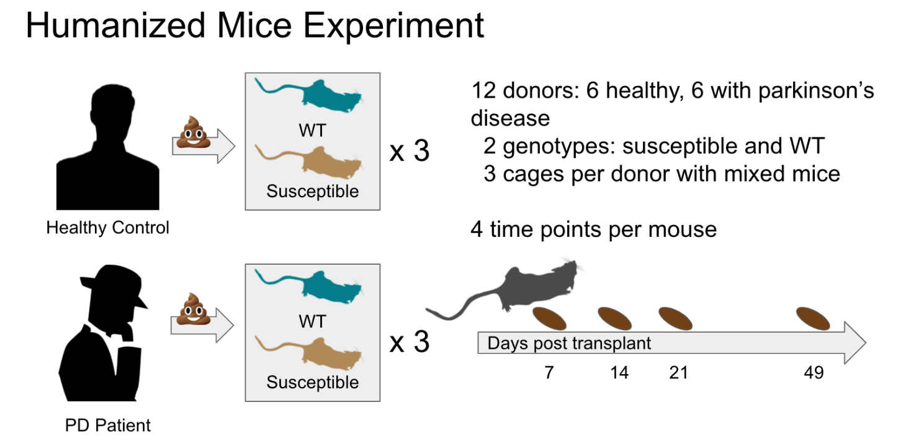

```{r setup, include=FALSE}
knitr::opts_chunk$set(echo = TRUE)
```

# What is qiime2R?

qiime2R is relatively new and allows qiime2 artifacts (.qza files) to be easily imported into the R environment. These can then be used to create phyloseq objects or to make figures directly. This is helpful because QIIME2 is only so flexible for making figures and doing statistics that it is often necessary to export your data and import into R to do something that QIIME2 can't do.

# We will be using data from the Parkinson's Mouse Tutorial:
https://docs.qiime2.org/2022.2/tutorials/pd-mice/

# Although it is not required reading, the relevant paper can be found here:
https://pubmed.ncbi.nlm.nih.gov/27912057/

# Description of study:
We will be working with a subset of a larger study conducted by Sampson et al., designed to determine whether the fecal microbiome plays a role in the development of Parkinson's disease. Mice were used as a model organism to understand this dynamic, as it is easier to conduct a study and it would take too long to see the disease development in human study. To do this, feces were collected from 6 donors with Parkinson's and 6 age- and sex-matched healthy controls. The fecal microbiome was transplanted into two types of mice: those predisposed to Parkinson's due to a gene mutation and resistant wild-type mice. Mice were observed for 7 weeks to see if they developed Parkinson's disease signs.

# Picture of study design:
```{r pressure, echo=FALSE, fig.cap="A caption", out.width = '100%'}

```

To complete this tutorial, be sure to have all files that were uploaded to the class GitHub repository in the same working directory as this .Rmd file in your computer.

# First, let's install qiime2R:
```{r}
if (!requireNamespace("devtools", quietly = TRUE)){install.packages("devtools")}
devtools::install_github("jbisanz/qiime2R")
```

# Now load in the libraries we will use for this tutorial:
```{r libraries}
library(qiime2R)
library(tidyverse)
```

# What kind of data will we be working with?
In microbiome data analysis, there are two main pieces of data that you need to do anything. 

1. Metadata. This is all of the information associated with your samples. Our data analysis wouldn't mean anything if we didn't have any metadata associated with our samples. 
2. Feature table. This is a table that contains counts of each unique sequence in each sample in the dataset. Typically, you will have the sample name in the first column, the feature name (i.e., the "microbe") in the first row, and a matrix full of numbers that describes how many times a "microbe" is present in each sample. Feature tables can be in several different file formats. Today, the feature table we are working with is in the .qza format, and we can import this directly into R.

# Import our metadata:
```{r}
metadata <- read_q2metadata("metadata.tsv")
```

# In your environment, click on your metadata to explore it.

We are going to use the read_qza function to import our feature table. Let's learn more about this function before we use it.
```{r}
?read_qza
```

# Import the feature table:
```{r}
SVs <- read_qza("table.qza")
```

# Use the names command to see what SVs contains
```{r}
names(SVs)
```

# What kind of data is stored in SVs? Let's look at the first 5 samples and the first 5 taxa.
```{r}
SVs$data[1:5,1:5]
```

We saw that SVs contains a uuid. QIIME 2 uses UUIDs, or Universally Unique Identifiers, to reference all results, and all executions of actions. These can be used, for example, to determine that a given artifact was generated as output from a specific execution of an action using data provenance. UUIDs are an unambiguous way to refer to QIIME 2 results, because they can never change without invalidating a QIIME 2 artifact (unlike file names, for example, which are easy to change and are thus unreliable for tracking results).

# Look at the uuid:
```{r}
SVs$uuid
```

QIIME2 has several different types of "artifacts." Artifacts are QIIME 2 results that are generally considered to represent intermediate data in an analysis, meaning that an artifact is generated by QIIME 2 and intended to be consumed by QIIME 2 (rather than by a human). Artifacts can be generated either by importing data into QIIME 2 or as out from a QIIME 2 action. When written to file, artifacts typically have the extension .qza, which stands for QIIME Zipped Artifact. Artifacts can be provided as input to QIIME 2 actions, loaded with tools such as the QIIME 2 Artifact API for use with Python 3 or qiime2R for use with R, or exported from QIIME 2 for use with other software.

# Look at the artifact type of our SVs object:
```{r}
SVs$type
```

# Let's explore our feature table more by getting a list of files within SVs (because in simpler terms, it is just a zipped file) and their sizes:
```{r}
SVs$contents
```
We've seen "provenance" a few times now. Provenance is information describing how a QIIME 2 result was generated. This will include details on all of the QIIME 2 actions that led to the creation of an artifact, including the values of all parameters, and references to all inputs and results as UUIDs. Data provenance additionally contains the literature citations that are relevant to the generation of a QIIME 2 result. Those citations should be included in all published work that derives from a given QIIME 2 result.

# Let's print the provenance for SVs.
```{r}
print_provenance(SVs)
```

As you can see, there is a lot to track in QIIME2 data analysis!

Now that we are more familiar with our metadata and feature table, let's make some plots to explore how the data within our feature table looks across metadata categories. In microbiome studies, it is typical to look at the alpha diversity and the beta diversity of your samples.

Alpha diversity is a measure of microbiome diversity applicable to a single sample. There are several metrics that can be used to measure alpha diversity. One of the most simple metrics is observed features, or how many microbial species are present in a sample (also known as "richness"). Other alpha diversity metrics, like Faith's Phylogenetic Diversity, incorporate richness and phylogenetic relatedness into one metric. Shannon's Diversity is another common metric. This incorporates richness and "evenness", or the abundance of microbial species. 

For the purposes of this tutorial, these metrics have already been calculated for you in QIIME2. If you're curious about how these files were made, take the Metcalf Lab QIIME2 workshop on August 15th-16th! Today, we are going to import vectors that contain per-sample alpha diversities for the three metrics discussed above.

# Import our alpha diversity files
```{r}
observed_features <- read_qza("observed_features_vector.qza")
faith_pd <- read_qza("faith_pd_vector.qza")
shannon <- read_qza("shannon_vector.qza")
```

# Let's start with observed features
```{r}
# put sample IDs into a column called "SampleID"
observed_features <- observed_features$data %>% rownames_to_column("SampleID") 

# add an observed_features column to our metadata file
metadata<-
  metadata %>% 
  left_join(observed_features)

# look for the new column
head(metadata)

# plot observed features for each of the genotype_and_donor_status groups
metadata %>%
  ggplot(aes(x=genotype_and_donor_status, y=observed_features, color = genotype)) +
  geom_boxplot() +
  xlab("Group") +
  ylab("Observed Features") +
  theme_q2r() # try other themes like theme_bw() or theme_classic()
```

Just by looking at the above plot, how does the alpha diversity differ between groups using the observed features metric?

Alpha diversity can be informative, but you may notice that the plot above does not include any statistical analysis. In microbiome data analysis, we have to use non-parametric statistical tests because microbiome data almost never follows a normal distribution. For alpha diversity, we can use a Kruskal-Wallis test for comparisons with two groups, or a pairwise Wilcox test for comparisons with more than two groups.

# Here, we can ask "Does the mouse genotype significantly affect the number of observed features?" Note that there are two genotypes, wild type and susceptible.
```{r}
kruskal.test(observed_features ~ genotype, data = metadata)
kruskal.test(observed_features ~ donor_status, data = metadata)
```

# If we want to test differences between groups within genotype_and_donor_status (there are four groups in this column), we need to do a pairwise Wilcox test.
```{r}
pairwise.wilcox.test(metadata$observed_features, metadata$genotype_and_donor_status,
                 p.adjust.method = "BH")
```

You will notice a warning that says "cannot compute exact p-value with ties." This is a result of working with such a small subset of data for this tutorial, and there are too few samples within each group to calculate corrected p-values (as is needed for pairwise comparisons). You can ignore this warning for this tutorial, but with your own data you should ensure that you have enough samples that allows for accurate statistical calculations.

Here, is there a significant difference in the number of observed features between groups?

#Now let's look at this question with a different alpha diversity metric. Before, we were only looking at the number of species within groups. Next we will use Faith's Phylogenetic Diversity to understand if there is a difference in phylogenetic relatedness between the groups.
```{r}
# put sample IDs into a column called "SampleID"
faith_pd <- faith_pd$data %>% rownames_to_column("SampleID") 

# add an observed_features column to our metadata file
metadata<-
  metadata %>% 
  left_join(faith_pd)

# look for the new column
head(metadata)

# plot faith PD each of the genotype_and_donor_status groups
metadata %>%
  ggplot(aes(x=genotype_and_donor_status, y=faith_pd, color = genotype)) +
  geom_boxplot() +
  xlab("Group") +
  ylab("Faith PD") +
  theme_q2r() # try other themes like theme_bw() or theme_classic()
```

# Like before, we want to do statistical analyses on our Faith PD measurements between groups.
```{r}
kruskal.test(faith_pd ~ genotype, data = metadata)
kruskal.test(faith_pd ~ donor_status, data = metadata)

pairwise.wilcox.test(metadata$faith_pd, metadata$genotype_and_donor_status,
                 p.adjust.method = "BH")
```

Are trends between groups the same or different between observed features and Faith PD? Do you think phylogenetic relatedness plays a role in how the microbiome of genotype_and_donor_status groups differ?

# The last alpha diversity metric we will look at is Shannon (richness + evenness)
```{r}
# put sample IDs into a column called "SampleID"
shannon <- shannon$data %>% rownames_to_column("SampleID") 

# add an observed_features column to our metadata file
metadata<-
  metadata %>% 
  left_join(shannon)

# look for the new column
head(metadata)

# plot observed features for each of the genotype_and_donor_status groups
metadata %>%
  ggplot(aes(x=genotype_and_donor_status, y=shannon_entropy, color = genotype)) +
  geom_boxplot() +
  xlab("Group") +
  ylab("Shannon") +
  theme_q2r() # try other themes like theme_bw() or theme_classic()
```

# Shannon statistics
```{r}
kruskal.test(shannon_entropy ~ genotype, data = metadata)
kruskal.test(shannon_entropy ~ donor_status, data = metadata)

pairwise.wilcox.test(metadata$shannon_entropy, metadata$genotype_and_donor_status,
                 p.adjust.method = "BH")
```

Do you think the abundance of features plays a role in differing alpha diversity between groups?
