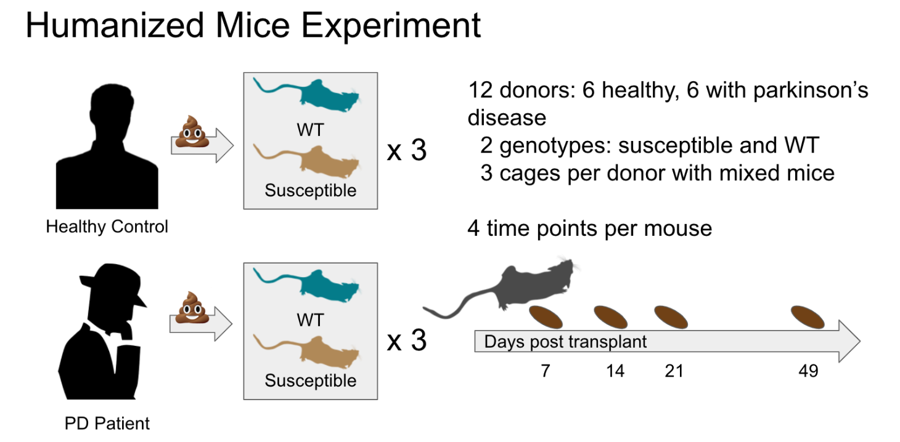

```{r setup, include=FALSE}
knitr::opts_chunk$set(echo = TRUE)
```

# As a reminder from the day 1 tutorial, here is our study design:
```{r pressure, echo=FALSE, fig.cap="A caption", out.width = '100%'}

```
# Load in libraries:
```{r libraries}
library(qiime2R)
library(tidyverse)
```

# Reimport our metadata and feature table into our environment (these are the same files as from day 1):
```{r}
metadata <- read_q2metadata("metadata.tsv")
SVs <- read_qza("table.qza")
```

After analyzing and doing statistics on alpha diversity, it is very common in microbiome analysis to next look at the beta diversity. While alpha diversity is a measure of microbiome diversity applicable to a single sample, beta diversity is a measure of similarity or dissimilarity of two communities. As a result, the output of beta diversity calculations is a distance matrix in which each number within the matrix represents the similarity or dissimilarity between two samples. These types of matrices are also referred to as resemblance matrices.

We can explore beta diversity using Principal Coordinate Analysis (often called PCoA) plots. These plots are aimed at graphically representing a resemblance matrix between categorical or continuous elements in your data set. You will see that the axes in these plots are unique. Instead of having a label the represents something from your metadata, the axes are labeled with percentages. These axes were "drawn" such that they represent the greatest amount of variation that could be found within the data set. Effectively, if you see a trend in a metadata category along an axis, you can say that "this metadata trend can explain X % of the variation within this data set."

Like with alpha diversity, there are several different beta diversity metrics that we can and should look at in microbiome data analysis that will help to understand different things about the data. Here are some common ones:

1. Bray Curtis - non-phylogenetic, quantifies quantifies what features are shared between samples, weighted by feature abundance
2. Jaccard - non-phylogenetic, quantifies what features are shared between samples, not weighted by feature abundance
3. Unweighted UniFrac - phylogenetic, not weighted by feature abundance
4. Weighted UniFrac - phylogenetic, weighted by feature abundance

For each of these metrics, the PCoA results have been generated for you in QIIME2.

# Let's import all of our PCoA results for the four metrics listed above using the read_qza function:
```{r}
bray_curtis <- read_qza("bray_curtis_pcoa_results.qza")
jaccard <- read_qza("jaccard_pcoa_results.qza")
unwe_unifrac <- read_qza("unweighted_unifrac_pcoa_results.qza")
we_unifrac <- read_qza("weighted_unifrac_pcoa_results.qza")
```

# Explore the bray curtis pcoa results
```{r}
bray_curtis$uuid #get the uuid associated with the bray curtis pcoa file
head(bray_curtis$data$ProportionExplained) #look at the PC axes percentiles
bray_curtis$data$Vectors[1:5, 1:3] #for the first 5 samples, position along PC1 and PC2
```

# Make the Bray Curtis PCoA plot by genotype_and_donor_status
```{r}
bray_curtis$data$Vectors %>%
  select(SampleID, PC1, PC2) %>%
  left_join(metadata) %>%
  ggplot(aes(x=PC1, y=PC2, color=`genotype_and_donor_status`)) +
  geom_point() +
  theme_q2r() +
  scale_color_discrete(name = "Genotype and Donor Status")
```
What kind of trend, or "clustering" do you see?

# Let's make PCoA plots for each of the other discussed metrics. We can do these all in one code chunk, and then click the output boxes to see each of the plots.
```{r}
jaccard$data$Vectors %>%
  select(SampleID, PC1, PC2) %>%
  left_join(metadata) %>%
  ggplot(aes(x=PC1, y=PC2, color=`genotype_and_donor_status`)) +
  geom_point() +
  theme_q2r() +
  ggtitle("Jaccard") +
  scale_color_discrete(name = "Genotype and Donor Status")

unwe_unifrac$data$Vectors %>%
  select(SampleID, PC1, PC2) %>%
  left_join(metadata) %>%
  ggplot(aes(x=PC1, y=PC2, color=`genotype_and_donor_status`)) +
  geom_point() +
  theme_q2r() +
  ggtitle("Unweighted UniFrac") +
  scale_color_discrete(name = "Genotype and Donor Status")

we_unifrac$data$Vectors %>%
  select(SampleID, PC1, PC2) %>%
  left_join(metadata) %>%
  ggplot(aes(x=PC1, y=PC2, color=`genotype_and_donor_status`)) +
  geom_point() +
  theme_q2r() +
  ggtitle("Weighted UniFrac") +
  scale_color_discrete(name = "Genotype and Donor Status")
```
What can you say based on the differences in beta diversity patterns between each of the metrics?

In QIIME2, you can and should do a PERMANOVA test to add statistical significance to the clustering we see here. Since doing this test is a bit more complicated in R, especially when using distance matrices that were made in QIIME2, we won't do this today. Instead, we will test which features are differentially abundant between our groups of interest. 

We will do this using a tool called ANCOM-BC. In short, ANCOM-BC (https://www.nature.com/articles/s41467-020-17041-7) estimates the unknown sampling fractions and corrects bias induced by their differences among samples. The absolute abundances are then modeled using a linear regression framework. This method provides statistically valid tests with p-values, it provides confidence intervals for the differential abundance of each taxon, and it can control the false discovery rate while also maintaining adequate power. 

# There are a few packages you will need in order for this to work in your environment.
```{r}
# installing ANCOM-BC
# if R asks to update packages, say all and press enter, and then say 'yes' when prompted
if (!requireNamespace("BiocManager", quietly = TRUE))
  install.packages("BiocManager")
<<<<<<< Updated upstream
BiocManager::install("ANCOMBC")
BiocManager::install("phyloseq")
BiocManager::install("microbiome")
=======
#BiocManager::install("ANCOMBC")
#BiocManager::install("phyloseq")
#BiocManager::install("microbiome")
>>>>>>> Stashed changes
```

# You can install DT from the CRAN repository.

# Load in our new libraries:
```{r}
library(ANCOMBC)
library(phyloseq)
library(microbiome)
library(DT)
```

# First, check out ANCOM-BC
```{r}
?ancombc
```

# Re-import our data as a phyloseq object:
```{r}
physeq <- qza_to_phyloseq(
  features = "table.qza",
  tree = "tree.qza",
  taxonomy = "taxonomy.qza",
  metadata = "metadata.tsv"
)
physeq
```

# Collapse taxonomy at the genus level
```{r}
genus_data = aggregate_taxa(physeq, "Genus")
```

# Run ANCOM-BC. For simplicity, we will do this only with the donor group (healthy or PD)
```{r}
out = ancombc(phyloseq = genus_data, formula = "genotype_and_donor_status", 
              p_adj_method = "holm", zero_cut = 0.90, lib_cut = 1000, 
              group = "genotype_and_donor_status", struc_zero = TRUE, neg_lb = TRUE, tol = 1e-5, 
              max_iter = 100, conserve = TRUE, alpha = 0.05, global = TRUE)
res = out$res
res_global = out$res_global
```

Click on the output res_global. Are there any differentially abundant taxa? From this output, are you able to tell what groups the taxa are differentially abundant between?

# Now that we have run ANCOM-BC, we can look more closely at what taxa are differentially abundant between which groups

# First get the p-values
```{r}
# p-values
col_name = c("S.Healthy - S.PD","S.Healthy - WT.Healthy","S.Healthy - WT.PD")
tab_p = res$p_val
colnames(tab_p) = col_name
tab_p %>% datatable(caption = "P-values from the Primary Result") %>%
  formatRound(col_name, digits = 2)
```
# Get the adjusted p-values
```{r}
tab_q = res$q
colnames(tab_q) = col_name
tab_q %>% datatable(caption = "Adjusted p-values from the Primary Result") %>%
  formatRound(col_name, digits = 2)
```
# Now see the differentially abundant taxa
```{r}
tab_diff = res$diff_abn
colnames(tab_diff) = col_name
tab_diff %>% 
  datatable(caption = "Differentially Abundant Taxa 
            from the Primary Result")
```

Which taxa are differentially abundant between the genotype and donor status groups?

What if we want to see a visualization of all of the taxa within our data set? While there are lots of ways that we can do this, today we will do two. First, we will look at our taxonomic composition for each sample using a taxa bar plot.

# Let's check out the taxa_barplot function
```{r}
?taxa_barplot
```

# Make the bar plot by "genotype and donor status" and "donor" at the genus level
```{r}
metadata<-read_q2metadata("metadata.tsv")
SVs<-read_qza("table.qza")$data
taxonomy<-read_qza("taxonomy.qza")$data %>% parse_taxonomy()

taxasums<-summarize_taxa(SVs, taxonomy)$Genus

taxa_barplot(taxasums, metadata, "genotype_and_donor_status")
taxa_barplot(taxasums, metadata, "donor")
```
# Make a heatmap version of this
```{r}
taxa_heatmap(taxasums, metadata, "genotype_and_donor_status")
taxa_heatmap(taxasums, metadata, "donor")
```