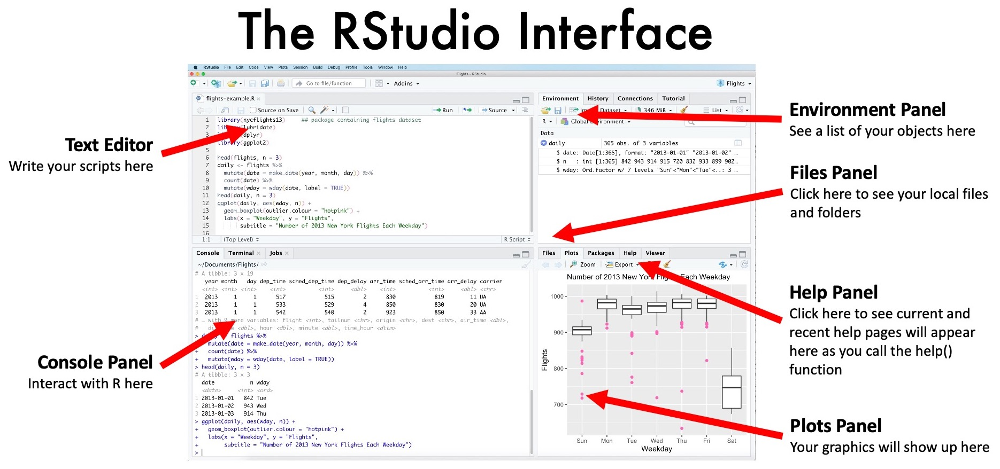
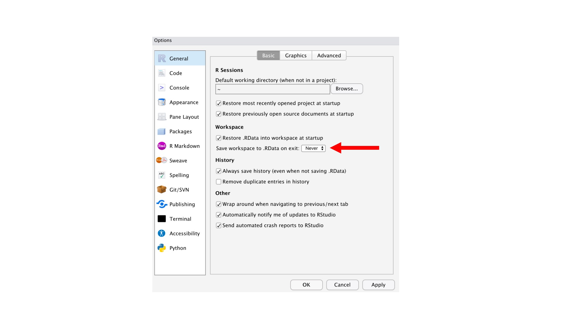

# R Basics

Let's get started!

January 24, 2022

## Lessons for today

 - [What is R?](#what-is-r)
 - [What is RStudio?](#what-is-rstudio)
 - [Interacting with R within RStudio](#interacting-with-r-within-rstudio)


## Useful references

  * [R-intro](https://cran.r-project.org/doc/manuals/r-release/R-intro.pdf) - .pdf documentation. R's manual
  * [Brooke Anderson's R youtube channel](https://www.youtube.com/channel/UC73v_zCdNE2aZrFZsG22JBw/videos) - lots of useful video content on basic R
  * [Base R Cheatsheet](https://iqss.github.io/dss-workshops/R/Rintro/base-r-cheat-sheet.pdf) - a handy 1-page guide to basic R functions
  * [swirl R](https://swirlstats.com/) - an interactive way to learn R within R
  * [Data Analysts Captivated by R's Power](https://archive.nytimes.com/www.nytimes.com/2009/01/07/technology/business-computing/07program.html) - 2009 NY Times article on R

-----


# What is R?


## R is a programming language
 * designed for statistics, plotting, & data analysis
 * comprised of a base package that can be functionality expanded through add-on packages
 * open-source
 * an interpreted language

## R is an ecosystem
 * the base package - R
 * the extended environment - packages, RStudio, documentation
 * the repository - CRAN (Comprehensive R Archive Network)
 * the governance, support, & organization - R Core Development Team, R Foundation, R Consortium, RStudio
 * the contribution community - developers
 * the user community - us


## How did R come to be?


  * 1976 - Bell Labs develops S, an open-source statistical programming language. The team was led by John Chambers.
  * 1991 - Ross Ihaka and Robert Gentleman at the University of Aukland in New Zealand embarks on a research venture to adapt S into R. 
    * Motivated to create a better user experience for academics
  * 1995 - first official beta release
  * 1997 - CRAN (Comprehensive R Archive Network) distributes R packages
  * 1997 - R Core Team, a governing body, is founded
  * 2000 - R 1.0.0 is released 
  * 2011 - R versions start getting funny nicknames. R 2.14.0 Great Pumpkin
  * 2010 - CRAN exceeds 10,000 published packages!
  * 2021 - R's latest version is 4.1.2 Bird Hippie


>  “R changed my opinion of humanity to some extent, to see how people are really willing to freely give of themselves and produce something larger than themselves without any thought of personal glory. There’s a lot of work with no recognition.” - Ross Ihaka

## Why do we use R in computational biology?

Why do we use any programming language in biology? 
  * To increase our speed & efficiency
  * To increase our scale
  * To promote reproducibility
  * To save money
  * To allow for transparency

Why use R in particular? What are its benefits for the life sciences?
  * Statistics is the heart of R
  * Packages extend R for biology-specific tasks
  * We can benefit from a wide, supportive, and dedicated community of users and developers who have created stereotyped documentation
  * R is beautiful

-----

# What is RStudio?


RStudio is an **Integrated Development Environment** or **IDE**. An IDE is a software application that allows programmerss to develop software within an organized user space. Think of it as a dedicated application in which we can interact with a programming language to generate organized software projects. IDE's combine a lot of useful tools all into one application with an organized layout.

:heavy_exclamation_mark: **EXERCISE: Exploring RStudio**

  * :arrow_right: Open R Studio. What does it look like?
  * It has a menu bar on the top and a series of windows.
  * **Console panel** - this is where R is loaded and ready to go. It shows you the version of R you are running. A prompt, which is denoted by the ">" character shows you that R is ready for your input. This is where we will **interact** with R. More on that later.
  * **Environment panel** - this is a list that will populate with **objects** as we create them in R. More on objects later. 
  * **Plots panel** - this is where plots and graphics will appear when we generate them.
  * _But wait! That's not all. We can toggle through other panels behind the Console, Environment, and Plot panels that are shown as defaults._
  * **Files panel** - This gives you the ability to browse and interact with the file structure on your own local computer.
  * **Help panel** - This will pop up with useful help information when you execute the help command. More on that later.
  * _Finally, there is one panel not shown upon opening RStudio, and that is the Text Editor_
  * **Text editor** - The text editor is a panel that allows you to write a script of R commands into a document that can be saved for later, executed one line at a time, or executed all at once.
  * :arrow_right: Let's start a new script so we can see the text editor.
    * :arrow_right: Go to **File** on the top menu bar
    * :arrow_right: Go to **New File**
    * :arrow_right: Select **R Script**

:white_check_mark: **GRAPHICAL SUMMARY:**



:warning: **BEST PRACTICES: Closing RStudio**

_When RStudio closes, by default, it will prompt you whether you want to "Save workspace image to ~/.Rdata". I recommend selecting **Don't Save**. Otherwise, the next time R starts up, your old objects will already be there waiting for you. It's better form to start from scratch with each new session. However, when working on very long projects, I will admit, this is a useful feature._

  * What to do? 
  * :arrow_right: Either remember to select **Don't Save** each time. 
  * :arrow_right: OR, you can change this setting by going to **RStudio** on the top menu, then **Preferences ...**, then changing **"Save workshopspace to .RData on exit"** from **Ask** to **Never**. It'll look like so:




-----

# Interacting with R within RStudio

_OK, now we know what R is and we know what RStudio is. But how do they work together? R is the algorithm, the actual program. We can think of R like the engine of a car. RStudio is the interface. We can think of it like the driver's seat of the car. So, we'll make ourselves comfortable within RStudio and use RStudio to instruct R what to do._

_How do we tell R what to do?_

_Remember how I said R is an **interpreted language**? This means that it is a language that executes its programs line-by-line. This is useful because it makes it much easier for us to interact with R in a line-by-line way. It's going to feel more like a conversation or dialogue than a **compiled language** would feel. In a compiled language, the whole script or program is written, then it is converted (or compiled) into another language that the computer can more readily understand and more quickly execute. So (warning more metaphores) think of an interpreted language more like direct messaging and a compiled language more like composing an e-mail._


:heavy_exclamation_mark: **EXERCISE: Your first conversation with R**

:arrow_right: We can interact with R through the **console**. Just type in some random characters and push return like so...

```
> sdfjksl
Error: object 'sdfjksl' not found
```

:confused: Hmm, that didn't work. Each line we write is called an **expression**. Turns out R doesn't know what the expression sdfjksl means. That's fair.

:arrow_right: Let's write an expression that R should recognize. Look in the welcome message. R invites us to use the command `citation()` to learn how to cite R.

```
> citation()

To cite R in publications use:

  R Core Team (2021). R: A language and environment for statistical computing. R
  Foundation for Statistical Computing, Vienna, Austria. URL
  https://www.R-project.org/.

A BibTeX entry for LaTeX users is

  @Manual{,
    title = {R: A Language and Environment for Statistical Computing},
    author = {{R Core Team}},
    organization = {R Foundation for Statistical Computing},
    address = {Vienna, Austria},
    year = {2021},
    url = {https://www.R-project.org/},
  }

We have invested a lot of time and effort in creating R, please cite it when using it
for data analysis. See also ‘citation("pkgname")’ for citing R packages.
```
  * Yay! That worked!

:warning: **BEST PRACTICES: Citing R**

  * _Please cite R and RStudio in your published works. Please cite all packages you use in published works. When reviewing manuscripts for publication, please check for these citation. This helps the community._


:heavy_exclamation_mark: **EXERCISE: More practice with R expressions**

  * :arrow_right: Try the following expressions on your own. What happens?

```r
> print("Hello World")
> date()
> getwd()
> Sys.info()[["user"]]
> 5 + 7
> 5+7
> x <- 5 + 7
> x
```

:smiley: Cool, huh! 

:warning: **WARNING** What if something doesn't work right?

  * If you don't complete your expression, R will give you a chance to finish it. 
  * :arrow_right: Try leaving R hanging...
```r
> 5 +
```
  * You can add `7` after and push return again. It should work.

:warning: **WARNING** What if that doesn't work?

  * You can push your **ESC** key to return to the prompt at any time.
  * :arrow_right: Try it
```r
> 5+
```
  * :arrow_right: Push **ESC**

:heavy_exclamation_mark: **EXERCISE: Using a script**

_In addition to interacting with R directly on the console, we can also write each of our expressions into a document called a **script**. Doing this will save each line for future use, for posterity. As we write this script, we can send each line to R interactively, one-by-one. Once we are happy with each expression, we can save the script._

  * :arrow_right: Save your **Untitled1** document as a script. Go to **File** in the top menu bar. Select **Save**. 
  * :arrow_right: Navigate or create an appropriate location for your script. Save your script as **220124_Module1_demo.R**.

_Write lines of code in your script._

  * :arrow_right: Write the following in your script. Any lines that start with **#** are **comments**. Those will be lines that are for humans to read. R will ignore them. This is how you will write copious notes. Get used to this!

```r
# My first script

print("Hello World")
date()
getwd()

```
  * :arrow_right: Execute the first line of the script by placing your cursor somewhere within the line `print("Hello World") and then clicking on the **Run** icon that contains a right-pointed arrow.
  * :arrow_right: Alternatively, we can use short cut keys. To do this, place your cursor somewhere within the line `date()` and hit **COMMAND** + **RETURN**
  * :arrow_right: We can execute multiple lines in succession by highlighting them together. Highlight the entire script from # to `getwd()`. Now, either click **Run** or use the shortcut to execute.

----

▶️ Continue on to [R Basics - Part 2](220124_R_Basics_2.md)
