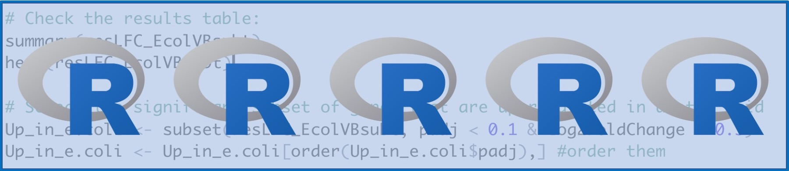
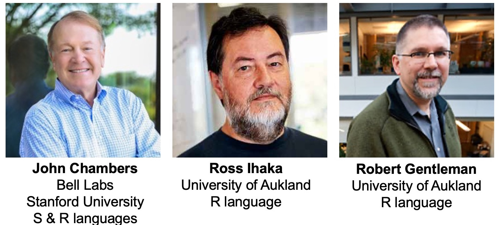

# R Basics

Let's get started!

January 24, 2022

## Lessons for today

 - What is R?
 - A tour of R-studio
 - Meet the different R objects
   - Values & Numbers
   - Vectors
   - Dataframes
   - Matrices

-----

# What is R?

## R is a programming language
 * designed for statistics, plotting, & data analysis
 * comprised of a base package that can be functionality expanded through add-on packages
 * open-source
 * an interpreted language

## R is an ecosystem
 * the base package - R
 * the extended environment - packages, RStudio, documentation
 * the repository - CRAN (Comprehensive R Archive Network)
 * the governance, support, & organization - R Core Development Team, R Foundation, R Consortium, RStudio
 * the contribution community - developers
 * the user community - us

## How did R come to be?

  * 1976 - Bell Labs develops S, an open-source statistical programming language. The team was led by John Chambers.
  * 1991 - Ross Ihaka and Robert Gentleman at the University of Aukland in New Zealand embarks on a research venture to adapt S into R. 
    * Motivated to create a better user experience for academics
  * 1995 - first official beta release
  * 1997 - CRAN (Comprehensive R Archive Network) distributes R packages
  * 1997 - R Core Team, a governing body, is founded
  * 2000 - R 1.0.0 is released 
  * 2011 - R versions start getting funny nicknames. R 2.14.0 Great Pumpkin
  * 2010 - CRAN exceeds 10,000 published packages!
  * 2021 - R's latest version is 4.1.2 Bird Hippie

>  “R changed my opinion of humanity to some extent, to see how people are really willing to freely give of themselves and produce something larger than themselves without any thought of personal glory. There’s a lot of work with no recognition.” - Ross Ihaka

## Why do we use R in computational biology?

Why do we use any programming language in biology? 
  * To increase our speed & efficiency
  * To increase our scale
  * To promote reproducibility
  * To save money
  * To allow for transparency

Why use R in particular? What are its benefits for the life sciences?
  * Statistics is the heart of R
  * Packages extend R for biology-specific tasks
  * We can benefit from a wide, supportive, and dedicated community of users and developers who have created stereotyped documentation
  * R is beautiful

-----

# What is RStudio?

RStudio is an **Integrated Development Environment** or **IDE**. An IDE is a software application that allow programmerss to develop software within an organized user space. Think of it as a dedicated application in which we can interact with a programming language. This is a nice way to stay organized when doing programming projects.

:heavy_exclamation_mark: ### EXERCISE: Exploring RStudio

  * Open R Studio. What does it look like?
  * 
