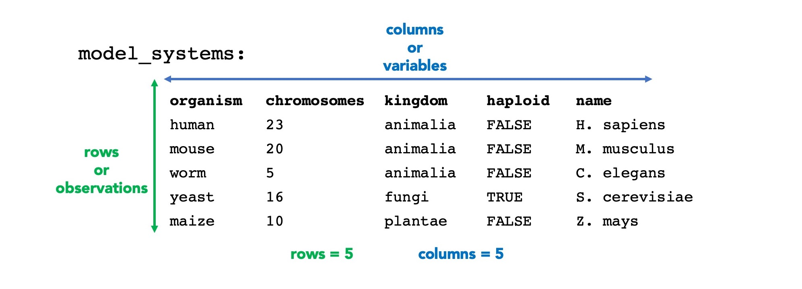

# R Basics - Part 2
January 24, 2022

## Lessons in this section
  * [The basic syntax of R expressions](#the-basic-syntax-of-r-expressions)
  * [Vector Objects](#vector-objects)
  * [Data Frame Objects](#data-frame-objects)


## Useful References

-----

# The basic syntax of R expressions

R is a language. The expressions we write on each line of R have their own internal logic. At a fundamental level, expressions are comprised of **functions** and **objects**.


Everything that exists in R is held in an object. All the information we save, all the data we interact with. Everything will be in an object. Objects come in different types, or classes. These classes differ in their structure and rules. In this introduction, we'll learn about the object classes called **vectors** and **data frames**, and that's about it. **Vectors** are 1-dimensional, ordered lists of similar types of data. In contrast, **data frames**, are 2-dimensional arrays of tabular data.


The functions will operate on the objects. Some functions are restricted in which objects they can take as input. Other functions will operate a little bit differently depending on the type of object used as input.

## Assignment

**Assignment** is the process of linking an object's **value** to its **name**. We've already seen this:

```r
x <- 5 + 7
x
[1] 12
```

  * The `<-` is a special operator called the **gets** operator that assigns the object 12 to the object name **x**

## Recollection

We can then **recall** the value of **x** by simply typing it into the prompt. 

```r
x
[1] 12
```

## Keeping track of objects

There are two main ways to keep track of all the objects that have been assigned. These are referred to as objects in your environment. 

 1. **List function**: We can **list** all the objects in use using the function `ls()`. 

:arrow_right: **TRY IT**

```r
> ls()
```

  2. **Environment** panel. Look up in the right corner of RStudio where the **Environment** panel lists all the objects in the environment.


-----

# Vector Objects

Vectors are lists of ordered data points. Vectors work best when they gather up lists of similar types of data. For example, we can create a vector **organisms** that contains character strings (words, basically). 

## Vector Assignment

Here, I'll show you how to make a vector object from scratch. This is a useful thing to know, but just keep in mind, as we continue on with R, you'll start to populate objects, not just by writing them _de novo_ but by reading data into the objects. 

Vectors are assigned using the **concatenate function**. It's the shortest function around. Just `c()`. We'll combine this with the **gets operator** like so:

❗ **EXERCISE: Baby's first vector object**

➡️ **FOLLOW ALONG**

```r
# assign a series of words to the vector object called organism:
organism <- c("human", "mouse", "worm", "yeast", "maize")

# Then, recall it:
organism

# How many elements are in this vector?
length(organism)

# What is the third element?
organism[3]
```

:warning: **BEST PRACTICES in object naming**

  * ONLY use letters, numbers, and the underscore character in object names
  * ONLY start the name with a LETTER
  * TRY not to use the name of a function as the name for an object
  * TRY to use names that will be meaningful in the context of your script.
  * Names are CASE SENSITIVE so come up with a convention that works for you.
    * all lower case, underscore separator


## There are different types of vector objects

Our vector object **organism** is of the type **character** because it only contains words (also called strings). These types are also called **classes** even though we can think of it as a sub-class.

➡️ **FOLLOW ALONG**

```r
# What is the class of the vector organism?
class(organism)

# What is the structure of the vector organism?
str(organism)
```

Vectors come in different classes. Here are just a few:


❓ **How is a factor vector different from a character vector?** This is a subtle point. Factor vectors must be expressly specified. They are special types of character vectors which describe categories. Certain functions are able to then group the categories together and perform tasks on the groups.

❓ **Which vectors need quotation marks?** Character and factor vector elements must be enclosed in quotation marks during assignment. Numerical and logical vectors do not.

## Vector Indexing

Recalling a vector involves typing its name. The full set of values stored in the vector object are displayed or used as input in a function. What if we only want to use or access _certain_ elements? This is called **indexing**. The most simple way to pull out an element is by its position using `[ ]` brackets like so:

➡️ **TRY IT**

```r
organism[1]
organism[2]
```

There are fancier ways to index. Most of this is covered in the [Base R Cheatsheet](https://iqss.github.io/dss-workshops/R/Rintro/base-r-cheat-sheet.pdf), a handy 1-page guide to base R functions. Here is what the cheatsheet covers for vector indexing:


## Vector Class Conversion

We've established that vectors come in different classes such as character, numeric, factor, or logical. Sometimes, we want to force a vector's class to change. This is the case for factor vectors. Factor vectors oftentimes need to be explicitly specified.

❗**EXERCISE**: Creating factor vectors

➡️ **FOLLOW ALONG**

```r
# Let's create a vector for each organism's kingdom like so:
kingdom <- c("animalia", "animalia", "animalia", "fungi", "plantae")

# What is the class of this vector?
class(kingdom)

# What is its structure?
str(kingdon)

# By default, this vector is a character vector. However, we can convert it to a character vector like so. This is a reassignment expression that overwrites the old vector kingdom with a factor vector.
kingdom <- as.factor(kingdom)

# check what happened:
class(kingdom)
str(kingdom)

```

Why would we want to do this? There are some functions that can take advantage of factors and use them to gather like-categories together into groups.

Possible factor conversions. One can move down this table without losing information, but not up this table:


## Homework Assignment 1 - Question 1

Let's move over to the homework assignment and work on Question 1 to reinforce this material.

▶️ [Homework Assignment 1](Assignment%201.md)

-----

# Data Frame Objects

Data frames store information in a 2-D grid of information. You can think of a data frame as combining one or more vectors of the same length in which every nth element of the vectors correspond.

Data frames are organized from top-to-bottom in **rows**, sometimes also called **observations**. Data frames are organized across by **columns**, also called **variables**.



## Data frame assignment

Once we really get going in R, we will assign values to data frames largely through import functions. For today, I'll show you how to make a data frame from scratch out of component vectors. Each vector will turn into a column.

We'll use the function `data.frame()` to do this. To use the function, enclose a list of the vectors separated by commas:

`data.frame(vector1, vector2, vector3)`

❗ **EXERCISE: Baby's first data frame**

➡️ **FOLLOW ALONG**

```r
# Ensure you have a character vector called organism with a length of 5
str(organism)

# Ensure you have a factor vector called kingdom with a length of 5
str(kingdom)

# Create a numeric vector called chromosomes with corresponding data:
chromosomes <- c(23, 20, 5, 16, 10)
str(chromosomes)

# Create a logical vector called haploid with corresponding data
haploid <- c(FALSE, FALSE, FALSE, TRUE, FALSE)
str(haploid) 

# Now, put it all together using the function data.frame()
model_systems <- data.frame(organism, chromosomes, kingdom, haploid)

# Explore what you have created
model_systems
dim(model_systems)
str(model_systems)
class(model_systems)
```

Notice how `dim` shows you the dimensions of the object model_systems.

## Data frame indexing

  * **Recall** - Again, we can recall the values within the data frame object by simply typing its name. 
  * **Big data** - Sometimes, these data frames get really huge. In these cases, only the top bit of the data frame is shown. 
  * **Head** - In other cases, we can force only the very top of a data frame to be displayed using `head()`:

```r
head(model_systems)
```

  * **Columns** - We can pull out specific columns of data using a special syntax that involves the special character **$** like so:

➡️ **FOLLOW ALONG**

```r
model_systems$chromosomes

model_systems$haploid
```
  * **Subset** - We can pull out just a slide of the data, be they rows, columns, or individual subsets of cells using a syntax in the form of `[row, column]`. Like so...

➡️ **FOLLOW ALONG**

```r
model_systems[3, ]

model_systems[ ,2]

model_systems[3,2]

```

## Cool functions to use on data frames

A large number of functions work on data frames. It is really one of the most common object classes used in R, in my experience. Let's explore some useful, basic functions...

❗ **EXERCISE: Exploring data frames**

➡️ **FOLLOW ALONG**

```r
# How many rows are there?
nrow(model_systems)

# How many columns are there?
ncol(model_systems)

# What are the names of the columns?
colnames(model_systems)

# What is the dimension of the data frame?
dim(model_systems)

# What is the structure of this object?
str(model_systems)

# Can you give me a summary of the data?
summary(model_systems)

```

## Homework Assignment 1 - Question 2

Let's move over to the homework assignment and work on Question 2 to reinforce this material.

▶️ [Homework Assignment 1](Assignment%201.md)
