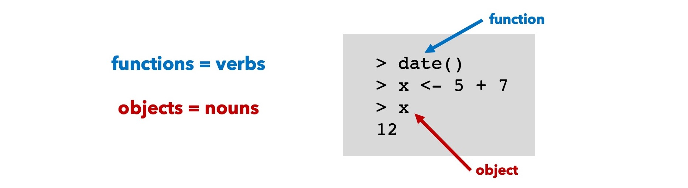
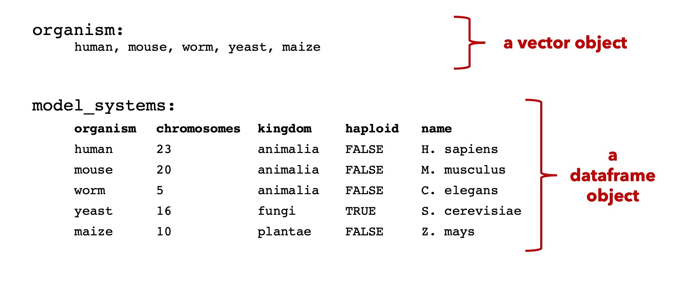
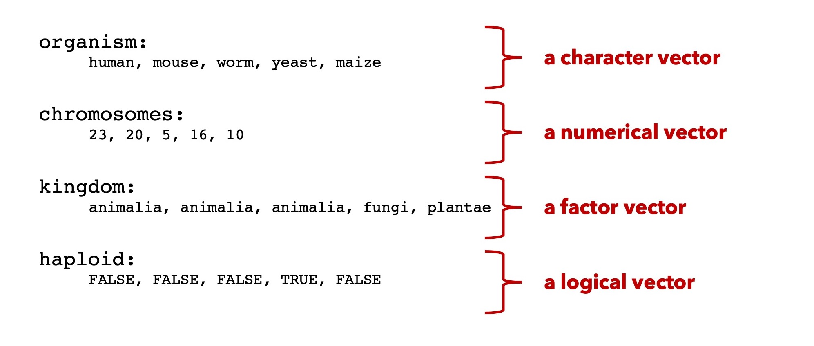

# R Basics
January 24, 2022

## Lessons in this section
  * [The basic syntax of R expressions](#the-basic-syntax-of-r-expressions)
  * [Vector Objects](#vector-objects)
  * Dataframe Objects
  * Functions

## Useful References

-----

# The basic syntax of R expressions

_R is a language. The expressions we write on each line of R have their own internal logic. At a fundamental level, expressions are comprised of **functions** and **objects**._



Everything that exists in R is held in an object. All the information we save, all the data we interact with. Everything will be in an object. Objects come in different types, or classes. These classes differ in their structure and rules. In this introduction, we'll learn about the object classes called **vectors** and **dataframes**, and that's about it. **Vectors** are 1-dimensional, ordered lists of similar types of data. In contrast, **dataframes**, are 2-dimensional arrays of tabular data.



The functions will operate on the objects. Some functions are restricted in which objects they can take as input. Other functions will operate a little bit differently depending on the type of object used as input.

## Assignment

**Assignment** is the process of linking an object's **value** to its **name**. We've already seen this:

```r
> x <- 5 + 7
> x
[1] 12
```

  * The `<-` is a special operator called the **gets** operator that assigns the object 12 to the object name **x**

## Recollection

We can then **recall** the value of **x** by simply typing it into the prompt. 

```r
> x
[1] 12
```

## Keeping track of objects

There are two main ways to keep track of all the objects that have been assigned. These are referred to as objects in your environment. 

 1. **List function**: We can **list** all the objects in use using the function `ls()`. 

:arrow_right: **TRY IT**

```r
> ls()
```

  2. **Environment** panel. Look up in the right corner of RStudio where the **Environment** panel lists all the objects in the environment.


-----

# Vector Objects

Vectors are lists of ordered data points. Vectors work best when they gather up lists of similar types of data. For example, we can create a vector **organisms** that contains character strings (words, basically). 

## Vector Assignment

Here, I'll show you how to make a vector object from scratch. This is a useful thing to know, but just keep in mind, as we continue on with R, you'll start to populate objects, not just by writing them _de novo_ but by reading data into the objects. 

Vectors are assigned using the **concatenate function**. It's the shortest function around. Just `c()`. We'll combine this with the **gets operator** like so:

❗ **EXERCISE: Baby's first vector object**

➡️ **FOLLOW ALONG**

```r
# assign a series of words to the vector object called organism:
> organism <- c("human", "mouse", "worm", "yeast", "maize")

# Then, recall it:
> organism

# How many elements are in this vector?
> length(organism)

# What is the third element?
organism[3]
```
## There are different classes of vector objects

Our vector object **organism** is of the class **character** because it only contains words (also called strings). 

➡️ **FOLLOW ALONG**

```r
> class(organism)
```

Vectors come in different classes. Here are just a few:



❓ **How is a factor vector different from a character vector?** This is a subtle point. Factor vectors must be expressly specified. They are special types of character vectors which describe categories. Certain functions are able to then group the categories together and perform tasks on the groups.

❓ **Which vectors need quotation marks?** Character and factor vector elements must be enclosed in quotation marks during assignment. Numerical and logical vectors do not.


