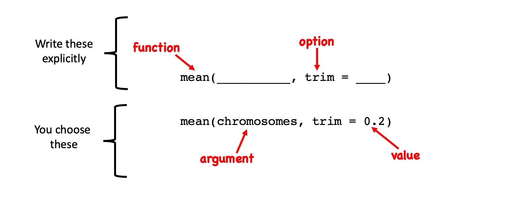
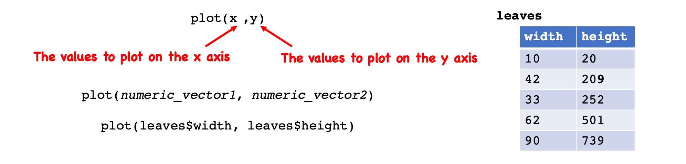
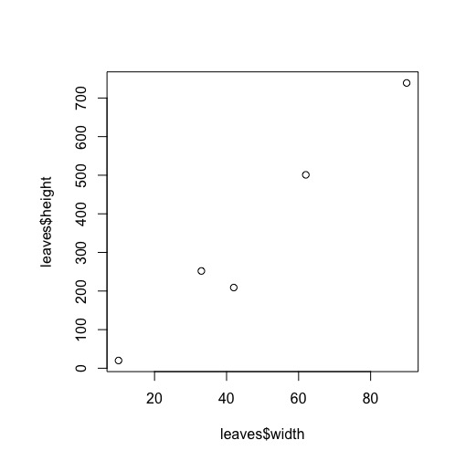
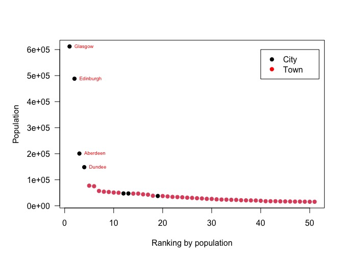

# R Next Steps

January 26, 2022

## Lessons for today

  * [Functions - the verbs of the R language](#functions---the-verbs-of-the-r-language)
  * [Importing data](#import-and-export-of-data)
  * [Plotting](#plotting)
  * [Packages](#Packages)

## Useful references

 * [Base R cheat sheet](https://iqss.github.io/dss-workshops/R/Rintro/base-r-cheat-sheet.pdf)
 * [Basic lessons on R & R plotting](https://www.w3schools.com/r/r_graph_plot.asp)
 * R plotting basics
 * [Tidyverse](https://www.r-graph-gallery.com/index.html)
 * [A ggplot2 Tutorial](https://www.cedricscherer.com/2019/08/05/a-ggplot2-tutorial-for-beautiful-plotting-in-r/)
 * [The R Graph Gallery](https://www.r-graph-gallery.com/index.html)
 * [Learn more with swirl](https://swirlstats.com/)


----

# Functions - the verbs of the R language

By now, you are already experienced in calling R functions. Here are some examples:

```r

date()

dim(model_systems)

mean(chromosomes)

```

Functions typically involve parentheses. Sometimes these parentheses are empty and sometimes we type something in them. Think of this similar to how some verbs take direct objects (I threw the ball) and some don't (I run). 

Two different types of information can go in the parentheses: **arguments** and **options**.

  * **ARGUMENTS**: These are object names that are added inside the parentheses. They are what the function will operate on. They are analogous to direct objects in English. 
  * **OPTIONS**: Think of these as adverbs. These are optional content you can add that changes **how** the function will operate.

The `help()` function gives us information about how a function operates. The help page will tell us
   * What a function does
   * Whether it requires an argument
   * what object classes are allowed as arguments
   * The potential list of options
   * The default values associated with each option

➡️ Try the help function

```r
help(dim)
```

  * The `x` in the example tells you that this function takes an argument. If we read under **ARGUMENTS** we can learn whith object classes are allowed.

➡️ Let's look at the help menu for `mean`.

```r
help(mean)
```

This help menu also specifies the **options** that the mean function takes and their **default** values. As a default, trim is set to 0. In other words, all the values are used to calculate the mean. However, this value can be changed to 0.2, in which case, the most extreme 20 % of all datapoints will be removed before the mean is calculated. 

➡️ Give it a try:

```r
mean(chromosomes, trim = 0.2)
```

⚠️ **GRAPHICAL SUMMARY** 




# Importing Data

So far, we've created objects by assignment expressions that directly specify their values. Next, we'll learn how to **import** data into R through an special assignment expression.

First, let's download a dataset to import. 

❗**EXERCISE** Download a data file

  * Go to [scottish_towns_wikipedia.txt](https://drive.google.com/file/d/12scoAC57ZsmUS82oXUb2qWFKcTHm9LVD/view?usp=sharing)
  * ➡️ Open the page
  * ➡️ Download by selecting the down arrow icon in the top right corner
  * ➡️ Save the file to a directory on your computer that makes sense
  * ➡️ Ensure the file name saved is "scottish_towns_wikipedia.txt"
  * Note - I just generated this file from [this wikipedia page](https://en.wikipedia.org/wiki/List_of_towns_and_cities_in_Scotland_by_population)

To import the file into R, we first need to **set the working directory**. This will specify the directory where the file lives.

❗**EXERCISE** Set the working directory

  * ➡️ Go to the **Files** Panel of RStudio.
  * ➡️ Navigate to the location containing the downloaded dataset
  * ➡️ Change the working directory by going to the **Files Menu Banner**, selecting **More**, and selecting **Set As Working Directory**
  * ➡️ For posterity, copy and paste the command line that appears on the console that looks like `setwd(directory/directory/)` into your .R script for next time


To determine where R "thinks it is" on your computer, use the command `getwd()` for **get working directory**.

```r
getwd()
```

❗**EXERCISE** Import the data file.

We will use the command `read.table()` to import the dataset

```r
# Check we're in the right place
getwd() 

# Check how read.table is used
help(read.table)

# Look at the data using read.table
read.table("scottish_towns_wikipedia.txt", header = TRUE)

# Actually, I don't like those number row names
read.table("scottish_towns_wikipedia.txt", header = TRUE, row.names = "Locality")

# That only printed out the data from the file, it didn't capture it.
# To capture the data, use an assignment expression:
scottish_towns <- read.table("scottish_towns_wikipedia.txt", header = TRUE, row.names = "Locality")
```

⚠️ **BEST PRACTICES** Exploratory Data Analysis

➡️ Look at what you have acquired and make sure everything looks good!

```r
dim(scottish_town)
str(scottish_towns)
class(scottish_towns)
```

## Cleaning, Wrangling, & Munging

One thing you will discover is that it takes A LOT of time to make your data nice and neat and tidy. Getting everything set up perfectly so that a function will run on an object takes a lot of ground work. This ground work goes by many names, usually depending on how frustrated the user is. It's called either cleaning, wrangling, or munging data. 

I had to clean up this data quite a bit to make the neat and tidy file you just imported. I removed footnotes. I made the Column Header "Council Area" one word instead of two. 

Next, we have a little to do list here:

  1. Let's remove the commas from the **Population** elements
  2. Let's set the **Population** column to be a numeric vector
  3. Let's set the **Status** and **CouncilArea** columns to be factor vectors

To do this, we will employ a process called **reassignment** in which we re-write columns of data

```r

# Remove commas and set Population to numeric
scottish_towns$Population <- as.numeric(gsub(",","",scottish_towns$Population))

# Set Status and Council.area to factors 
scottish_towns$Status <- as.factor(scottish_towns$Status)
scottish_towns$Council.area <- as.factor(scottish_towns$Council.area)

# What happened?
str(scottish_towns)

```

# Plotting

  * Plotting and graphics are really what make R special. R graphics can handle a large amount of data and packages extend base R into capabilities that are very impressive.
  * [The R Graph Gallery](https://www.r-graph-gallery.com/index.html) has some impressive examples.
  * To be honest, the graphics in base R are pretty clunky and tricky to modify. For today, I'll show you how to make a simple R plot using the scottish_towns dataset.

**X Y SCATTER PLOT** The function `plot()` uses the following syntax to plot x and y values into a scatter plot:



The result looks like this:



❗ **EXERCISE: Basic R Plot

➡️ Let's try it!

```r
# We can use integer or numeric classes as input
str(scottish_towns)

# We'll use these x-values...
scottish_towns$Rank

# ... and these y-values:
scottish_towns$Population

# Plot
plot(scottish_towns$Rank, scottish_towns$Population)

# Let's add color
plot(scottish_towns$Rank, scottish_towns$Population, col = scottish_towns$Status)

# ready to get fancy? 
# this is just a demonstration
par(mar = c(5.1, 6.1, 4.1, 2.1))
plot(scottish_towns$Rank,
     scottish_towns$Population,
      col = scottish_towns$Status,
      las = 1,
      ylab = NA,
      xlab = "Ranking by population",
      pch = 19)
 mtext("Population", side=2, line=4) 
 text(scottish_towns$Rank[1:4], scottish_towns$Population[1:4], 
      row.names(scottish_towns)[1:4], cex=0.6, pos=4, col="red", )
 legend(40, 600000, legend=c("City", "Town"),
        col=c("black", "red"), pch = 19)
```

## Saving plots

To save a plot, we can simply use the **Export** menu item on the top of the Plots panel. You can export your plot as a .pdf and specify the width and height of the output image. You may need to play around. Sometimes, things can be buggy.

I used the following options:


This generated the following plot:



# Packages

When it comes to graphics, the base R plot is going to start to feel very limiting fairly quickly. For example, it is a real pain to change the numeric formatting of the population from scientific notation to plain ol' 100,000 notation. This gets frustrating. Packages specifically designed to make plotting easy, organized, and beautiful will keep you from going crazy. 

The most popular package for plotting is **ggplot2**. It is part of a larger suite of R packages called the [**tidyverse**](https://www.tidyverse.org/). You will learn more about tidyverse in later modules of this course.

To check out what is possible in ggplot2, look at this [handy ggplot2 plotting guide](https://www.cedricscherer.com/2019/08/05/a-ggplot2-tutorial-for-beautiful-plotting-in-r/).

❓ **How do we install new packages?**

  * Step 1 - Install the package. This happens once. It will download the package from the internet and save it on your local computer. You can do from within R using the `install.packages()` function OR, you can do it in RStudio through the menu **Tools** and then **Install Packages...*
  * Step 2 - Each time you start RStudio, you'll need to load the package from the library. This makes it available for use. Think of this like checking out a book from the library. It uses the function `library()`.

**INSTALLING TIDYVERSE**

*just an example. You may have already done this. Or you should do it later. It may take some time.*

```r
# Do this once:
install.packages("tidyverse")

# Do this each time you want to use a tidyverse package:
library(tidyverse)
```


