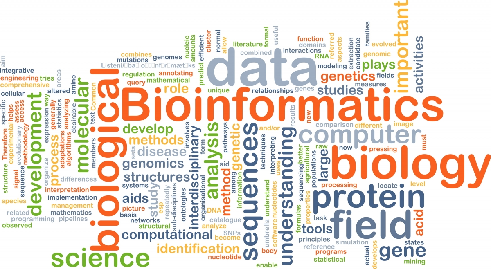

# R and RStudio

Instructor: Erin Osborne Nishimura, PhD

Dates: Monday January 24, 2022 & Wednesday January 26, 2022

__Welcome to the first module of CM580A3 - Introduction to Quantitative Cell and Molecular Biology!__

In this first module, we will explore the basics of R. What is R? R is a programming language, a coding environment, and a whole community. The goal of this module is __not__ to master R. That will take time. Here, we will just get to know a few basics of interfacing with and using R. This knowledge will help you to explore the concepts in later modules. 

## Learning objectives for this module

  * Students and instructors are invited to **start fresh** with their own pre-conceived notions of programming, computation, and quantitation
  * Students will learn how and why R is **useful in biological research**
  * Students will learn how to **interface** with R and RStudio
  * Students will become familiar with a few basic **R objects**
  * Students will execute a few basic **R functions**
  * Students will learn to **import and export** data
  * Students will learn to extend functionality of R by loading **packages**
  * Students will gain experience in basic **plotting**

## Introductions

  * My background & my journey. How did I get here?
  * Your background & your journey. Where will you go?

## Who is a programmer? Who is a coder? Who is a computational biologist? Who is a bioinformatician? Who is a "geek"? What do these terms mean?

