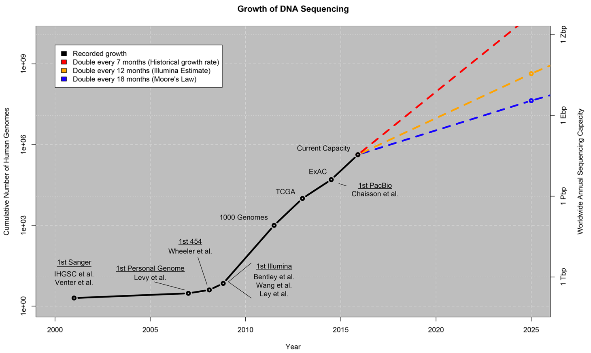
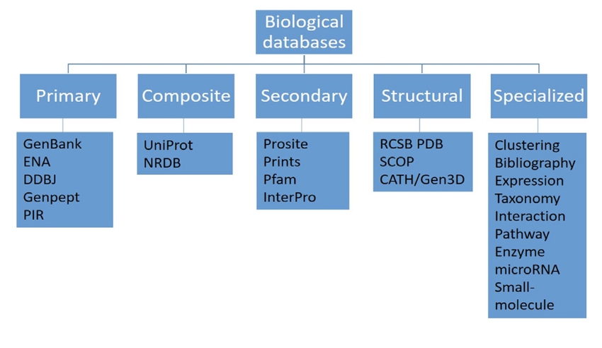

```{r setup, include=FALSE}
knitr::opts_chunk$set(echo = TRUE, error = TRUE, warning = FALSE)
```

```{r, message=FALSE}
# if you havent yet installed these packages please uncomment and do so now
#install.packages(c("usethis", "devtools", "dplyr", "tibble"))
#devtools::install_github('Timag/imageclipr')
#BiocManager::install("biomaRt")
```

```{r, message=FALSE}
# packages to load 
library(usethis)
library(biomaRt)
library(dplyr)
library(tibble)
library(imageclipr)
```

***
### Quick Survey
How many of you have worked with a biological database before? 

Which one(s)? 

***
### Biological Databases

As biological data accumulate at larger scales and increase at exponential paces, the number of biological databases that have been developed to manage such data are growing at ever-faster rates. 

These data can be in the form of nucleic acids (DNA and RNA), proteins, or small molecules. 

**Figure 1: Growth of DNA sequencing** (Stephens ZD et al., 2015. Big Data: Astronomical or Genomical?)


A biological database is an organized collection of data, usually assembled using software particularly designed to organize, query, update and retrieve the data.

The primary objective of biological databases is not just to store, organize, and share data in a structured and searchable manner with the aim to facilitate data retrieval and visualization, but also to provide web application programming interfaces for computers to exchange and integrate data from various database resources in an automated manner.

#### Databases are classified into 5 major categories:
- Primary: stores raw information in the form of sequences and structures.

- Composite: combine various databases at a single platform; they contain a search algorithm. 

- Secondary: contain derived information from primary databases; derived information being information that is the outcome of the analysis of data from primary databases. 

- Structural: contain structural data, like 3D crystal structures obtained from NMR or X-ray crystallography. 

- Specialized: include several different types of specialized databases such as clustering databases, bibliographic databases, and expression databases. 

**Figure 2.1: Biological database classification based on the data and major databases** (Parva Kumar Sharma and Inderjit Singh Yadav, 2022. Biological Databases and Their Application.)


*** 
### Example Biological Databases

1. [Mouse Genome Informatics](http://www.informatics.jax.org/)
2. [Human Microbiome Project](https://hmpdacc.org/)
3. [UCSC Genome Browser](https://genome.ucsc.edu/)
4. [ATCC Genome Portal](https://genomes.atcc.org/?_ga=2.36707625.827873597.1643044790-1176553054.1640723221)
5. [Human Genome Resources at NCBI](https://www.ncbi.nlm.nih.gov/genome/guide/human/) 
6. [FlyBase](https://flybase.org/) 
7. [The Human Metabolome Database](https://hmdb.ca/)
8. [MicrobeNet](https://www.cdc.gov/microbenet/index.html)
9. [EnsemblBacteria](https://bacteria.ensembl.org/index.html)
10. [Microbial Genomes](https://www.ncbi.nlm.nih.gov/genome/microbes/)
11. [KEGG: Kyoto Encyclopedia of Genes and Genomes](https://www.genome.jp/kegg/)
12. [PubChem](https://pubchem.ncbi.nlm.nih.gov/)
13. [VIOLIN: Vaccine investigation and online information network](http://www.violinet.org/)


*** 
### What type of questions can we ask with data from biological databases?

Any thoughts...?

- What genes/proteins are involved in water soluble vitamin digestion and absorption (i.e. B12) in mus musculus (the house mouse)?
- What vaccines are licensed for use in humans to prevent Polio?
- What is the genome of Pseudomonas aeruginosa and how similar is it to Pseudomonas fluorescens?


Lets look at an example using the paper "High Innate Immune Specificity through Diversified C-Type Lectin-Like Domain Proteins in Invertebrates" by Barbara Pees et al., 2016. 

    A key question in current immunology research is how the innate immune system can generate high levels of specificity. 
    
    For a long time, the generation of a highly specific immune responses was considered a hallmark of adaptive immunity. This is due to the diversity of T and B cell receptors generated by somatic recombination and hypermutation. Adaptive immunity exists within verterbrates only, and is classically thought to exist as far back as jawed verterbrates. Though evidence now supports its existance in jawless fish (i.e., agnathan sea lamprey). 
    
    So how do inverterbrates like Caenorhaditis elegans (C. elegans), which lack adaptive immunity, deal with different pathogens? 
    
    A prerequiste for the generation of a pathogen-specific immune response is a repertoir of diversified receptors. Evidence now supports that inverterbrates, which exclusively rely on innate defense mechanisms, can differentiate between pathogens on the species and even strain level. One such mechanism employed by C. elegans that is postulated to allow for the recognition of different pathogens is the expression of C-type lectins (clec).
    
    C. elegans have a reported 283 clec genes that produce 288 CLEC proteins. From verterbrates, we know that C-type lectins are a family of both soluble and membrane-bound proteins which bind a wide variety of ligands such as sugars, proteins, lipids, and inorganic compounds. This is mediated through a C-type lectin-like domain (CTLD). In C. elegans, the function of CLECs in immune detection and defense are not completely understood. Only a handful of CLECs have demonstrated roles in the C. elegans immune response.
  
Lets perform a database search for all the C. elegans 'clec' genes and determine how many are membrane bound versus secreted. Determining this will provide insight into which CLEC proteins mediate pathogen recognition (acting as receptors) and pathogen elimination (acting as immune effectors). To do this, we will use [Wormbase Parasite](https://parasite.wormbase.org/index.html). 

    Wormbase Parasite is a sub-portal of the main [Wormbase](https://wormbase.org//#012-34-5) website and is aimed at researchers engaged in parasitic worm genomics. WormBase ParaSite encompasses flatworms as well as nematodes (like C. elegans), and provides genome sequence, genome browsers, semi-automatic annotation and comparative genomics data for approximately one hundred species. Additional tools include a cross species data mining platform, protein and nucleotide sequence search, and a variant effect predictor to enable the analysis of different strain/isolate genomes in the context of the reference.

To set up our Wormbase Parasite Biomart search, lets first navigate through the website and use that information to guide our selections in R. 
    

Lets first establish a connection to the WormBase ParaSite BioMart
```{r}
mart <- useMart("parasite_mart", dataset = "wbps_gene", host = "https://parasite.wormbase.org", port = 443)
```

We can then list the available filters and attributes to pick from 
```{r}
#listFilters(mart) # I commented them out becease there are A LOT 
#listAttributes(mart)
```

Now lets build our query. 
First we will pull all C. elegans genes and assign them to an R object called 'Genes'.
```{r}
genes <- getBM(mart = mart,
                      filters = list(species_id_1010 = "caelegprjna13758", biotype = "protein_coding"),
               attributes = c("wbps_gene_id", "external_gene_id"))
```

Lets peek at 'genes'
```{r}
head(genes)
```

What type of object is 'genes' and what are its dimensions?
```{r}
# we can check with the class() and str() functions
class(genes)
str(genes)
```

How many genes does C. elegans have? 
```{r}
print(length(unique(genes$wbps_gene_id)))
```

Now lets search through 'genes' and find all of the clec genes. 
```{r}
genes %>% filter(grepl("clec", external_gene_id)) -> clec_genes
view(clec_genes)
```

How many did you find? 
```{r}
print(length(clec_genes$wbps_gene_id))
```

Interesting, this total number of clec genes doesn't match what was reported in the paper. Lets search [Wormbase](https://parasite.wormbase.org/index.html) and see how many clec genes are reported there. 

    Wormbase, is an international consortium of biologists and computer scientists providing the research community with accurate, current, accessible information concerning the genetics, genomics and biology of C. elegans and related nematodes. 

Wormbase shows 264 clec genes, still different from both the paper and what we found. Why might this be?

The paper, derived the 283 total genes from [InterPro](https://www.ebi.ac.uk/interpro/) by counting genes with at least one CTLD obtained by automatic annotation from the InterPro (v53.0) and Pfam (v28.0) databases. The number of CTLD proteins is higher than the CTLD gene number as it includes different isoforms encoded by the same gene. While the number of clec genes from Wormbase (264) includes 25 pseudogenes, which were not included in our Biomart search. 

    InterPro provides functional analysis of proteins by classifying them into families and predicting domains and important sites. To classify proteins in this way, InterPro uses predictive models, known as signatures, provided by several different databases (referred to as member databases) that make up the InterPro consortium. We combine protein signatures from these member databases into a single searchable resource, capitalizing on their individual strengths to produce a powerful integrated database and diagnostic tool.
    
Now that we have all the protein coding clec genes, lets explore the CLEC protein sequences and see what domains are annotated and predicted for each. 

    Barbara Pees et al., (2016) report that out of the 283 clec genes, 81% are predicted to have a signal peptide, meaning they are likely secreted. While 21% are predicted to have membrane-spanning properties, meaning they likely function as receptors and in cell signaling. The functional role of CLECs in C. elegans immune defense is partly dependent on if they are secreted proteins or membrane bound proteins. 
    
Lets pull our clec gene id's from our 'genes' data.frame and feed them into a new Biomart search. This time we will add the attributes: Interpro ID, InterPro short description, transmembrane domain, and signal domain.
```{r}
# First, lets make a new object containing all the clec wbps_gene_id. 
clec_gene_ids <- clec_genes$wbps_gene_id
head(clec_gene_ids, 20)
```

Establish a connection to the WormBase ParaSite BioMart
```{r}
mart <- useMart("parasite_mart", dataset = "wbps_gene", host = "https://parasite.wormbase.org", port = 443)
```

Now lets build our new query using the CLEC gene ids and add in additional attributes
```{r}
clec_pro_domains <- getBM(mart = mart,
                      filters = list(wbps_gene_id = clec_gene_ids),
                      attributes = c("wbps_gene_id", "external_gene_id", "wbps_peptide_id", "interpro_id", "interpro_short_description", "transmembrane_domain", "signal_domain"))
```

Lets view our new R object
```{r}
view(clec_pro_domains)
```

What type of object is 'clec_pro_domains'? 

What are the dimensions? 

What type of protein domains do we see? 

What does Cleavage site (SignalP) and Transmembrane (TMHMM) domain tell us?
    
    The cleavage site and transmembrane domain predictions tell us if a protein is predicted to have a signal peptide/cleavage site and is thus a secreted protein, or if a protein has a transmembrane sequence and is thus a membrane bound protein.  

***
### For more details on the predictive methods used, see info and links below 

The [SignalP 6.0](https://services.healthtech.dtu.dk/service.php?SignalP) server predicts the presence of signal peptides and the location of their cleavage sites in proteins from Archaea, Gram-positive Bacteria, Gram-negative Bacteria and Eukarya.

[TMHMM 2.0](https://services.healthtech.dtu.dk/service.php?TMHMM-2.0) is a membrane protein topology prediction method based on a hidden Markov model. It predicts transmembrane helices in proteins.    
    
    This version of SignalP uses neural networks, SignalP-TM and SignalP-noTM. They are both trained to recognize the signal peptide and the cleavage site in proteins. Their difference is in their negative data training set. The SignalP-noTM method was trained on 1 negative dataset using nuclear proteins for eukaryotes. The SignalP-TM method was trained on 2 negative datasets, using both nuclear proteins (no SP or CS) and protein sequences containing 1 or more transmembrane helices. 
   
    This is done to improve discrimination between SPs and TM domains, as the hydrophobic regions of SPs and hydrophobic regions of TM domains can get missidentified. 
   
    Both methods (TM vs noTM) are comparable, though creaters found that SignalP-TM doesnt work as well as SignalP-noTM when no transmembrane sequences are involved in your protein of interest. As such, SignalP-TM is used first and if less than 4 TM regions are predicited, SignalP-noTM (the default) will be used.
 
*** 
Ok, back to it. 

Now lets determine how many unique CLEC protein domains there are 
```{r}
view(unique(clec_pro_domains$interpro_short_description))

# this should output the same value, does it? 
view(unique(clec_pro_domains$interpro_id))
```

Lets generate some basic descriptive statistics about our protein domains.

We can determine the frequency of protein domains among CLECs
```{r}
freq_pro_doms <- table(clec_pro_domains$interpro_short_description)
view(sort(freq_pro_doms, decreasing = TRUE)) 
# the frequency of genes associated with a particular protein domain. 
```

```{r}
mean(freq_pro_doms)
median(freq_pro_doms)
max(freq_pro_doms)
min(freq_pro_doms)
range(freq_pro_doms) # we also get our min and max data points using range
hist(freq_pro_doms) # look at distribution of the data 
```

```{r}
# function used to produce result summaries. Depends on the class of the R object 
summary(freq_pro_doms) # why didn't this work?  

# determine the class of any R objects 'internal' type  
class(freq_pro_doms) 

# determine the (R internal) type or storage mode of any object
typeof(freq_pro_doms) 
```

```{r}
quantile(freq_pro_doms)

boxplot(freq_pro_doms)
```

Lets pull out the top 9 protein domains and IDs
```{r}
sorted_doms <- sort(freq_pro_doms, decreasing = TRUE)
sorted_doms <- as.data.frame(sorted_doms)
top9 <- sorted_doms[1:9, ]
view(top9)
print(top9)

clec_pro_domains[, 4:5] %>% filter(interpro_short_description %in% top9[,1]) -> Top9domIDs
view(unique(Top9domIDs))
print(unique(Top9domIDs))
```

We can now check out some of these protein domains in [InterPro](https://www.ebi.ac.uk/interpro/) and learn more about them. 

We can also perform a de novo search for protein domains with InterPro by inputting the protein sequence in FASTA format. Lets try this with CLEC-41. First we will go to Wormbase to get the protein sequence information. 

Now, lets subset our 'clec_pro_domains' data and make new data frames containing the putative secreted CLECs and membrane bound CLECs. 
```{r}
# this new dataset will contain all of the CLECs with only a predicted transmembrane domain
CLECs_TM <- clec_pro_domains %>% filter(transmembrane_domain == 'TMhelix' & signal_domain != 'SignalP-noTM' & signal_domain != 'SignalP-TM')
view(CLECs_TM)

# this new dataset will contain all of the CLECs with both a predicted transmembrane domain and a cleavage site
CLECs_TM_SP <- clec_pro_domains %>% filter(transmembrane_domain == 'TMhelix' & (signal_domain == 'SignalP-noTM' | signal_domain == 'SignalP-TM'))
view(CLECs_TM_SP)

# this new dataset will contain all of the CLECs with only a predicted cleavage site/signal peptide
CLECs_SP <- clec_pro_domains %>% filter(transmembrane_domain != 'TMhelix' & (signal_domain == 'SignalP-noTM' | signal_domain == 'SignalP-TM'))
view(CLECs_SP)

# this new dataset will contain all of the CLECs without any predicted transmembrane domain or cleavage site
CLECs_CS <- clec_pro_domains %>% filter(transmembrane_domain != 'TMhelix' & signal_domain != 'SignalP-noTM' & signal_domain != 'SignalP-TM')
view(CLECs_CS) 
```

How do our numbers compare to the paper? 
```{r}
a <- length(unique(clec_genes$external_gene_id)) # total number of clec genes
a

# what percentage of CLECs are membrane bound?
b <- length(unique((CLECs_TM$external_gene_id)))
(b/a)*100

# what percentage of CLECs are secreted? 
c <- length(unique(CLECs_SP$external_gene_id))
(c/a)*100

# what percentage of CLECs are cytosolic? 
d <- length(unique(CLECs_CS$external_gene_id))
(d/a)*100
  
# what percentage of CLECs have both a signla peptide and TM doamin 
e <- length(unique(CLECs_TM_SP$external_gene_id)) 
(e/a)*100
```

how do our numbers add up?
```{r}    
b+c+d+e
```

This doesnt add up to 239, why might this be? 

Well some of these clec genes (specifically clec-196, clec-238, and clec-205) give rise to a few CLEC isoforms that are predicted to contain either a TM domain or cleavage site.

On the other hand, some clec genes don't have any putative TM domain or cleavage site/signal peptide meaning they likely remain in the cytosol. 


***
### Now we have some data, what might the next steps be? 

A putative list of secreted and membrane bound CLECs in hand, lets ponder some possible ways to experimentally validate these predictions and assess their role in immune function. 

    How could we determine if a CLEC protein that is predicted to be membrane bound isn't actually secreted? 

This is explored by [Pan et al., 2022](https://journals.asm.org/doi/10.1128/mBio.02579-21) for CLEC-47. Here authors use cloning, recombinant expression, and Western blot to address this question. Interestingly, authors found that CLEC-47, which is predicted to have both a TM domain and a cleavage site, is actually a secreted protein. 
    
    How can we determine microbial binding and antimicrobial activity of CLEC proteins?

This is explored by [Pees et al., 2021](https://journals.plos.org/plospathogens/article?id=10.1371/journal.ppat.1009454) for CLEC-4, CLEC-41, and CLEC-42. Here authors use an in vitro bacterial binding assay (Western blot as the readout) and minimal inhibitory concentration (MIC) to inhibit visible bacterial growth to address these questions. 
