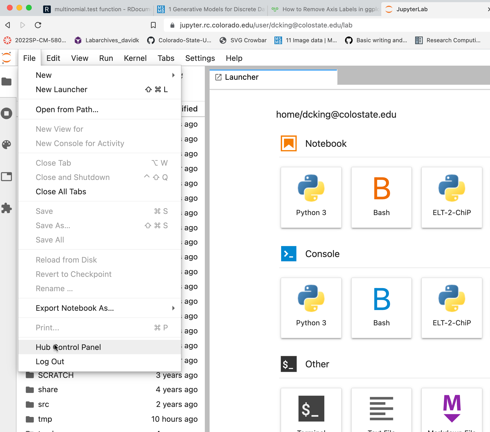
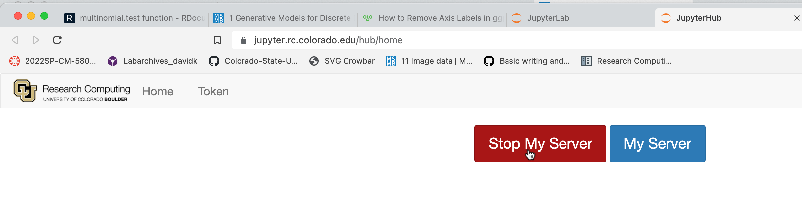

# Module 6 - Command Line, Summit and Variant-Calling Workflow

[Week1 - basics](week1)

[Week2 - Summit/Variant Calling](week2)

[Week3 - Variant Calling Part 2 - Read Trimming](week3)

[Week4 - Variant Calling Part 3 - Alignment](week4)


## Resources and tips

### CURC Documentation

https://curc.readthedocs.io/en/latest/

Conda instructions: https://curc.readthedocs.io/en/latest/software/python.html#configuring-conda-with-condarc


#### Special setup for CSU users 
... involves using a directy that omits the `@` sign. It is not always necessary, but some PERL code fails.

Below is how I would set up my configuration (username dcking@colostate.edu).

(The warning below is because I already have these settings)
```
$ conda activate /curc/sw/anaconda3/latest
$ conda config --add pkgs_dirs /projects/.colostate.edu/dcking/.conda_pkgs
Warning: '/projects/.colostate.edu/dcking/.conda_pkgs' already in 'pkgs_dirs' list, moving to the top
$ conda config --add envs_dirs '/projects/.colostate.edu/dcking/software/anaconda/envs'
Warning: '/projects/.colostate.edu/dcking/software/anaconda/envs' already in 'envs_dirs' list, moving to the top
```
Files will still be installed in `/projects/$USER`, but through a link which doesn't use an `@` sign.


Slides on Partitions and QoS: https://github.com/ResearchComputing/Partition_and_QoS_Fall_2021

### Stopping your jupyterhub server

It is good practice to stop your server once you are done working.

#### 1. Go to Hub Control Panel



#### 2. Click Stop My Server



#### 3. Close remaining jupyterhub tabs

Otherwise they will constantly prompt you to restart.
