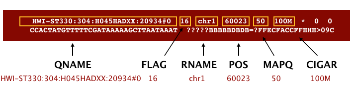

# Variant Calling Workflow part 3 - alignment

We mentioned before that we are working with files from a long-term evolution study of an E. coli population (designated Ara-3). Now that we have looked at our data to make sure that it is high quality, and removed low-quality base calls, we can perform variant calling to see how the population changed over time. We care how this population changed relative to the original population, E. coli strain REL606. Therefore, we will align each of our samples to the E. coli REL606 reference genome, and see what differences exist in our reads versus the genome.

## Alignment to reference genome


We perform read alignment or mapping to determine where in the genome our reads originated from. There are a number of tools to choose from and, while there is no gold standard, there are some tools that are better suited for particular NGS analyses. We will be using the Burrows Wheeler Aligner (BWA), which is a software package for mapping low-divergent sequences against a large reference genome.

The alignment process consists of two steps:

1. Indexing the reference genome
2. Aligning the reads to the reference genome

## Setting up

First we download the reference genome for E. coli REL606. Although we could copy or move the file with cp or mv, most genomics workflows begin with a download step, so we will practice that here.

```
cd /projects/$USER/dc_workshop
mkdir -p data/ref_genome
curl -L -o data/ref_genome/ecoli_rel606.fasta.gz ftp://ftp.ncbi.nlm.nih.gov/genomes/all/GCA/000/017/985/GCA_000017985.1_ASM1798v1/GCA_000017985.1_ASM1798v1_genomic.fna.gz
gunzip data/ref_genome/ecoli_rel606.fasta.gz
```

QUESTION: We saved this file as data/ref_genome/ecoli_rel606.fasta.gz and then decompressed it. What is the real name of the genome?


We will also download a set of trimmed FASTQ files to work with. These are small subsets of our real trimmed data, and will enable us to run our variant calling workflow quite quickly.

```
curl -L -o sub.tar.gz https://ndownloader.figshare.com/files/14418248
tar xvf sub.tar.gz
mv sub/ data/trimmed_fastq_small
```

You will also need to create directories for the results that will be generated as part of this workflow. We can do this in a single line of code, because mkdir can accept multiple new directory names as input.

```
mkdir -p results/sam results/bam results/bcf results/vcf
```

### Index the reference genome

Our first step is to index the reference genome for use by BWA. Indexing allows the aligner to quickly find potential alignment sites for query sequences in a genome, which saves time during alignment. 

Indexing the reference only has to be run once. The only reason you would want to create a new index is if you are working with a different reference genome or you are using a different tool for alignment.

**In jupyterhub, do:**

```
bwa index data/ref_genome/ecoli_rel606.fasta
```

While the index is created, you will see output that looks something like this:

```
[bwa_index] Pack FASTA... 0.04 sec
[bwa_index] Construct BWT for the packed sequence...
[bwa_index] 1.05 seconds elapse.
[bwa_index] Update BWT... 0.03 sec
[bwa_index] Pack forward-only FASTA... 0.02 sec
[bwa_index] Construct SA from BWT and Occ... 0.57 sec
[main] Version: 0.7.17-r1188
[main] CMD: bwa index data/ref_genome/ecoli_rel606.fasta
[main] Real time: 1.765 sec; CPU: 1.715 sec
```
### Align reads to reference genome

The alignment process consists of choosing an appropriate reference genome to map our reads against and then deciding on an aligner. We will use the BWA-MEM algorithm, which is the latest and is generally recommended for high-quality queries as it is faster and more accurate.

An example of what a `bwa` command looks like is below. This _command will not run_, as we do not have the files `ref_genome.fa`, `input_file_R1.fastq`, or `input_file_R2.fastq`.

```
bwa mem ref_genome.fasta input_file_R1.fastq input_file_R2.fastq > output.sam
```
Have a look at the [bwa options page](http://bio-bwa.sourceforge.net/bwa.shtml). While we are running bwa with the default parameters here, your use case might require a change of parameters. _NOTE: Always read the manual page for any tool before using and make sure the options you use are appropriate for your data._

We are going to start by aligning the reads from just one of the samples in our dataset (SRR2584866). Later, we will be iterating this whole process on all of our sample files.

**In jupyterhub, do:**

```
bwa mem data/ref_genome/ecoli_rel606.fasta data/trimmed_fastq_small/SRR2584866_1.trim.sub.fastq data/trimmed_fastq_small/SRR2584866_2.trim.sub.fastq > results/sam/SRR2584866.aligned.sam
```

You will see output that starts like this:

```
[M::bwa_idx_load_from_disk] read 0 ALT contigs
[M::process] read 77446 sequences (10000033 bp)...
[M::process] read 77296 sequences (10000182 bp)...
[M::mem_pestat] # candidate unique pairs for (FF, FR, RF, RR): (48, 36728, 21, 61)
[M::mem_pestat] analyzing insert size distribution for orientation FF...
[M::mem_pestat] (25, 50, 75) percentile: (420, 660, 1774)
[M::mem_pestat] low and high boundaries for computing mean and std.dev: (1, 4482)
[M::mem_pestat] mean and std.dev: (784.68, 700.87)
[M::mem_pestat] low and high boundaries for proper pairs: (1, 5836)
[M::mem_pestat] analyzing insert size distribution for orientation FR...
```

### SAM/BAM format
The [SAM file](https://genome.sph.umich.edu/wiki/SAM), is a tab-delimited text file that contains information for each individual read and its alignment to the genome. While we do not have time to go into detail about the features of the SAM format, the paper by [Heng Li et al.](http://bioinformatics.oxfordjournals.org/content/25/16/2078.full) provides a lot more detail on the specification.

The compressed binary version of SAM is called a BAM file. We use this version to reduce size and to allow for _indexing_, which enables efficient random access of the data contained within the file.

The file begins with a header, which is optional. The header is used to describe the source of data, reference sequence, method of alignment, etc., this will change depending on the aligner being used. Following the header is the alignment section. Each line that follows corresponds to alignment information for a single read. Each alignment line has 11 mandatory fields for essential mapping information and a variable number of other fields for aligner specific information. An example entry from a SAM file is displayed below with the different fields highlighted.



We will convert the SAM file to BAM format using the `samtools` program with the `view` command and tell this command that the input is in SAM format (`-S`) and to output BAM format (`-b`):

**In jupyterhub, do:**

```
samtools view -S -b results/sam/SRR2584866.aligned.sam > results/bam/SRR2584866.aligned.bam
```

Output:

```
[samopen] SAM header is present: 1 sequences.
```

### Sort BAM file by coordinates

Next we sort the BAM file using the sort command from samtools. -o tells the command where to write the output.

```
samtools sort -o results/bam/SRR2584866.aligned.sorted.bam results/bam/SRR2584866.aligned.bam 
```

Our files are pretty small, so we will not see this output. If you run the workflow with larger files, you will see something like this:

```
[bam_sort_core] merging from 2 files...
```

SAM/BAM files can be sorted in multiple ways, e.g. by location of alignment on the chromosome, by read name, etc. It is important to be aware that different alignment tools will output differently sorted SAM/BAM, and different downstream tools require differently sorted alignment files as input.

You can use samtools to learn more about this bam file as well.

```
samtools flagstat results/bam/SRR2584866.aligned.sorted.bam
```

This will give you the following statistics about your sorted bam file:

```
351169 + 0 in total (QC-passed reads + QC-failed reads)
0 + 0 secondary
1169 + 0 supplementary
0 + 0 duplicates
351103 + 0 mapped (99.98% : N/A)
350000 + 0 paired in sequencing
175000 + 0 read1
175000 + 0 read2
346688 + 0 properly paired (99.05% : N/A)
349876 + 0 with itself and mate mapped
58 + 0 singletons (0.02% : N/A)
0 + 0 with mate mapped to a different chr
0 + 0 with mate mapped to a different chr (mapQ>=5)
```

## Variant calling

A variant call is a conclusion that there is a nucleotide difference vs. some reference at a given position in an individual genome or transcriptome, often referred to as a Single Nucleotide Variant (SNV). The call is usually accompanied by an estimate of variant frequency and some measure of confidence. Similar to other steps in this workflow, there are a number of tools available for variant calling. In this workshop we will be using `bcftools`, but there are a few things we need to do before actually calling the variants.


### Step 1: Calculate the read coverage of positions in the genome

Do the first pass on variant calling by counting read coverage with bcftools. We will use the command mpileup. The flag `-O b` tells `bcftools` to generate a bcf format output file, -o specifies where to write the output file, and -f flags the path to the reference genome:

```
bcftools mpileup -O b -o results/bcf/SRR2584866_raw.bcf \
-f data/ref_genome/ecoli_rel606.fasta results/bam/SRR2584866.aligned.sorted.bam
```

```
[mpileup] 1 samples in 1 input files
```

We have now generated a file with coverage information for every base.

### Step 2: Detect the single nucleotide variants (SNVs)

Identify SNVs using bcftools call. We have to specify ploidy with the flag --ploidy, which is one for the haploid E. coli. -m allows for multiallelic and rare-variant calling, -v tells the program to output variant sites only (not every site in the genome), and -o specifies where to write the output file:

```
bcftools call --ploidy 1 -m -v -o results/vcf/SRR2584866_variants.vcf results/bcf/SRR2584866_raw.bcf 
```

### Step 3: Filter and report the SNV variants in variant calling format (VCF)

Filter the SNVs for the final output in VCF format, using vcfutils.pl:

`vcfutils.pl varFilter results/bcf/SRR2584866_variants.vcf  > results/vcf/SRR2584866_final_variants.vcf`

## Explore VCF format

`less -S results/vcf/SRR2584866_final_variants.vcf`

You will see the header (which describes the format), the time and date the file was created, the version of bcftools that was used, the command line parameters used, and some additional information:

```
##fileformat=VCFv4.2
##FILTER=<ID=PASS,Description="All filters passed">
##bcftoolsVersion=1.8+htslib-1.8
##bcftoolsCommand=mpileup -O b -o results/bcf/SRR2584866_raw.bcf -f data/ref_genome/ecoli_rel606.fasta results/bam/SRR2584866.aligned.sorted.bam
##reference=file://data/ref_genome/ecoli_rel606.fasta
##contig=<ID=CP000819.1,length=4629812>
##ALT=<ID=*,Description="Represents allele(s) other than observed.">
##INFO=<ID=INDEL,Number=0,Type=Flag,Description="Indicates that the variant is an INDEL.">
##INFO=<ID=IDV,Number=1,Type=Integer,Description="Maximum number of reads supporting an indel">
##INFO=<ID=IMF,Number=1,Type=Float,Description="Maximum fraction of reads supporting an indel">
##INFO=<ID=DP,Number=1,Type=Integer,Description="Raw read depth">
##INFO=<ID=VDB,Number=1,Type=Float,Description="Variant Distance Bias for filtering splice-site artefacts in RNA-seq data (bigger is better)",Version=
##INFO=<ID=RPB,Number=1,Type=Float,Description="Mann-Whitney U test of Read Position Bias (bigger is better)">
##INFO=<ID=MQB,Number=1,Type=Float,Description="Mann-Whitney U test of Mapping Quality Bias (bigger is better)">
##INFO=<ID=BQB,Number=1,Type=Float,Description="Mann-Whitney U test of Base Quality Bias (bigger is better)">
##INFO=<ID=MQSB,Number=1,Type=Float,Description="Mann-Whitney U test of Mapping Quality vs Strand Bias (bigger is better)">
##INFO=<ID=SGB,Number=1,Type=Float,Description="Segregation based metric.">
##INFO=<ID=MQ0F,Number=1,Type=Float,Description="Fraction of MQ0 reads (smaller is better)">
##FORMAT=<ID=PL,Number=G,Type=Integer,Description="List of Phred-scaled genotype likelihoods">
##FORMAT=<ID=GT,Number=1,Type=String,Description="Genotype">
##INFO=<ID=ICB,Number=1,Type=Float,Description="Inbreeding Coefficient Binomial test (bigger is better)">
##INFO=<ID=HOB,Number=1,Type=Float,Description="Bias in the number of HOMs number (smaller is better)">
##INFO=<ID=AC,Number=A,Type=Integer,Description="Allele count in genotypes for each ALT allele, in the same order as listed">
##INFO=<ID=AN,Number=1,Type=Integer,Description="Total number of alleles in called genotypes">
##INFO=<ID=DP4,Number=4,Type=Integer,Description="Number of high-quality ref-forward , ref-reverse, alt-forward and alt-reverse bases">
##INFO=<ID=MQ,Number=1,Type=Integer,Description="Average mapping quality">
##bcftools_callVersion=1.8+htslib-1.8
##bcftools_callCommand=call --ploidy 1 -m -v -o results/bcf/SRR2584866_variants.vcf results/bcf/SRR2584866_raw.bcf; Date=Tue Oct  9 18:48:10 2018
```
Followed by information on each of the variations observed:

```
#CHROM  POS     ID      REF     ALT     QUAL    FILTER  INFO    FORMAT  results/bam/SRR2584866.aligned.sorted.bam
CP000819.1      1521    .       C       T       207     .       DP=9;VDB=0.993024;SGB=-0.662043;MQSB=0.974597;MQ0F=0;AC=1;AN=1;DP4=0,0,4,5;MQ=60
CP000819.1      1612    .       A       G       225     .       DP=13;VDB=0.52194;SGB=-0.676189;MQSB=0.950952;MQ0F=0;AC=1;AN=1;DP4=0,0,6,5;MQ=60
CP000819.1      9092    .       A       G       225     .       DP=14;VDB=0.717543;SGB=-0.670168;MQSB=0.916482;MQ0F=0;AC=1;AN=1;DP4=0,0,7,3;MQ=60
CP000819.1      9972    .       T       G       214     .       DP=10;VDB=0.022095;SGB=-0.670168;MQSB=1;MQ0F=0;AC=1;AN=1;DP4=0,0,2,8;MQ=60      GT:PL
CP000819.1      10563   .       G       A       225     .       DP=11;VDB=0.958658;SGB=-0.670168;MQSB=0.952347;MQ0F=0;AC=1;AN=1;DP4=0,0,5,5;MQ=60
CP000819.1      22257   .       C       T       127     .       DP=5;VDB=0.0765947;SGB=-0.590765;MQSB=1;MQ0F=0;AC=1;AN=1;DP4=0,0,2,3;MQ=60      GT:PL
CP000819.1      38971   .       A       G       225     .       DP=14;VDB=0.872139;SGB=-0.680642;MQSB=1;MQ0F=0;AC=1;AN=1;DP4=0,0,4,8;MQ=60      GT:PL
CP000819.1      42306   .       A       G       225     .       DP=15;VDB=0.969686;SGB=-0.686358;MQSB=1;MQ0F=0;AC=1;AN=1;DP4=0,0,5,9;MQ=60      GT:PL
CP000819.1      45277   .       A       G       225     .       DP=15;VDB=0.470998;SGB=-0.680642;MQSB=0.95494;MQ0F=0;AC=1;AN=1;DP4=0,0,7,5;MQ=60
CP000819.1      56613   .       C       G       183     .       DP=12;VDB=0.879703;SGB=-0.676189;MQSB=1;MQ0F=0;AC=1;AN=1;DP4=0,0,8,3;MQ=60      GT:PL
CP000819.1      62118   .       A       G       225     .       DP=19;VDB=0.414981;SGB=-0.691153;MQSB=0.906029;MQ0F=0;AC=1;AN=1;DP4=0,0,8,10;MQ=59
CP000819.1      64042   .       G       A       225     .       DP=18;VDB=0.451328;SGB=-0.689466;MQSB=1;MQ0F=0;AC=1;AN=1;DP4=0,0,7,9;MQ=60      GT:PL
```

This is a lot of information, so let’s take some time to make sure we understand our output.

The first few columns represent the information we have about a predicted variation.


| column	| info |
| ------- | ---- |
| CHROM	  | contig location where the variation occurs |
| POS     | position within the contig where the variation occurs |
| ID	    | a . until we add annotation information |
| REF   	| reference genotype (forward strand) |
| ALT	    | sample genotype (forward strand) |
| QUAL 	  | Phred-scaled probability that the observed variant exists at this site (higher is better) |
| FILTER  |	a . if no quality filters have been applied, PASS if a filter is passed, or the name of the filters this variant failed |

In an ideal world, the information in the QUAL column would be all we needed to filter out bad variant calls. However, in reality we need to filter on multiple other metrics.


The last two columns contain the genotypes and can be tricky to decode.

| column	| info |
|---------|------|
| FORMAT	|lists in order the metrics presented in the final column |
| results	| lists the values associated with those metrics in order |

For our file, the metrics presented are GT:PL:GQ.

| metric | definition |
|--------|------------| 
|  GT	   | the genotype of this sample which for a diploid genome is encoded with a 0 for the REF allele, 1 for the first ALT allele, 2 for the second and so on. So 0/0 means homozygous reference, 0/1 is heterozygous, and 1/1 is homozygous for the alternate allele. For a diploid organism, the GT field indicates the two alleles carried by the sample, encoded by a 0 for the REF allele, 1 for the first ALT allele, 2 for the second ALT allele, etc. |
|  PL	   | the likelihoods of the given genotypes |
|  GQ	   | the Phred-scaled confidence for the genotype |
| AD, DP | the depth per allele by sample and coverage |

The Broad Institute’s [VCF guide](https://www.broadinstitute.org/gatk/guide/article?id=1268) is an excellent place to learn more about the VCF file format.

Do:

`grep -v "#" results/vcf/SRR2584866_final_variants.vcf | wc -l`

...to see how many variants were called.

[Optional step: visualization.](https://datacarpentry.org/wrangling-genomics/04-variant_calling/index.html#assess-the-alignment-visualization---optional-step)

## Assess the alignment (visualization) - optional step
It is often instructive to look at your data in a genome browser. Visualization will allow you to get a “feel” for the data, as well as detecting abnormalities and problems. Also, exploring the data in such a way may give you ideas for further analyses. As such, visualization tools are useful for exploratory analysis. In this lesson we will describe two different tools for visualization: a light-weight command-line based one and the Broad Institute’s Integrative Genomics Viewer (IGV) which requires software installation and transfer of files.

In order for us to visualize the alignment files, we will need to index the BAM file using samtools:

`samtools index results/bam/SRR2584866.aligned.sorted.bam`

### Viewing with tview

Samtools implements a very simple text alignment viewer based on the GNU ncurses library, called tview. This alignment viewer works with short indels and shows MAQ consensus. It uses different colors to display mapping quality or base quality, subjected to users’ choice. Samtools viewer is known to work with a 130 GB alignment swiftly. Due to its text interface, displaying alignments over network is also very fast.

In order to visualize our mapped reads, we use tview, giving it the sorted bam file and the reference file:

```
samtools tview results/bam/SRR2584866.aligned.sorted.bam data/ref_genome/ecoli_rel606.fasta
1         11        21        31        41        51        61        71        81        91        101       111       121
AGCTTTTCATTCTGACTGCAACGGGCAATATGTCTCTGTGTGGATTAAAAAAAGAGTGTCTGATAGCAGCTTCTGAACTGGTTACCTGCCGTGAGTAAATTAAAATTTTATTGACTTAGGTCACTAAATAC
..................................................................................................................................
,,,,,,,,,,,,,,,,,,,,,,,,,,,,,,,,,,,, ..................N................. ,,,,,,,,,,,,,,,,,,,,,,,,,,,,,,,,........................
,,,,,,,,,,,,,,,,,,,,,,,,,,,,,,,,,,, ..................N................. ,,,,,,,,,,,,,,,,,,,,,,,,,,,.............................
...................................,g,,,,,,,,,,,,,,,,,,,,,,,,,,,,,,,,,  ....................................   ................
,,,,,,,,,,,,,,,,,,,,,,,,,,,,,,,,,,,....................................   ....................................      ,,,,,,,,,,
,,,,,,,,,,,,,,,,,,,,,,,,,,,,,,,,,,,,  ....................................  ,,a,,,,,,,,,,,,,,,,,,,,,,,,,,,,,     .......
,,,,,,,,,,,,,,,,,,,,,,,,,,,,,,, .............................  ,,,,,,,,,,,,,,,,,g,,,,,    ,,,,,,,,,,,,,,,,,,,,,,,,,,,,
,,,,,,,,,,,,,,,,,,,,,,,,,,,,,,,,,,,  ...........................T.......   ,,,,,,,,,,,,,,,,,,,,,,,c,          ......
......................... ................................   ,g,,,,,,,,,,,,,,,,,,,      ...........................
,,,,,,,,,,,,,,,,,,,,, ,,,,,,,,,,,,,,,,,,,,,,,,,,,,,,, ,,,,,,,,,,,,,,,,,,,,,,,,,,,       ..........................
,,,,,,,,,,,,,,,,,,,,,,,,,,,,,,,,,,,   ................................T..  ..............................   ,,,,,,
...........................       ,,,,,,g,,,,,,,,,,,,,,,,,   ....................................         ,,,,,,
,,,,,,,,,,,,,,,,,,,,,,,,,, ....................................  ...................................        ....
....................................  ........................  ,,,,,,,,,,,,,,,,,,,,,,,,,,,,,,,,,,,,      ....
,,,,,,,,,,,,,,,,,,,,,,,,,,,,,,,,,,,,   ,,,,,,,,,,,,,,,,,,,,,,,,,,,,,,,,,,,,  ,,,,,,,,,,,,,,,,,,,,,,,,,,,,,,,,,
........................            .................................. .............................     ....
,,,,,,,,,,,,,,,,,,,,,,,,,,,,,,,,,,,,   ....................................        ..........................
...............................       ,,,,,,,,,,,,,,,,,,,,,,,,,,,,,,,, ....................................
...................................  ,,,,,,,,,,,,,,,,,,,,,,,,,,,,,,,,  ,,,,,,,,,,,,,,,,,,,,,,,,,,,,,,,,,,,
,,,,,,,,,,,,,,,,,,,,,,,,,,,,,,,,,,,, ,,,,,,,,,,,,,,,,,,,,,,,,,,,,,,,,,,  ..................................
.................................... ,,,,,,,,,,,,,,,,,,a,,,,,,,,,,,,,,,,,        ,,,,,,,,,,,,,,,,,,,,,,,,,
,,,,,,,,,,,,,,,,,,,,,,,,,,,,,,,,,,,  ............................ ,,,,,,,,,,,,,,,,,,,,,,,,,,,,,,,,,,,,
```

The first line of output shows the genome coordinates in our reference genome. The second line shows the reference genome sequence. The third line shows the consensus sequence determined from the sequence reads. A `.` indicates a match to the reference sequence, so we can see that the consensus from our sample matches the reference in most locations. That is good! If that was not the case, we should probably reconsider our choice of reference.

Below the horizontal line, we can see all of the reads in our sample aligned with the reference genome. Only positions where the called base differs from the reference are shown. You can use the arrow keys on your keyboard to scroll or type `?` for a help menu. To navigate to a specific position, type `g.` A dialogue box will appear. In this box, type the name of the “chromosome” followed by a colon and the position of the variant you would like to view (e.g. for this sample, type `CP000819.1:50` to view the 50th base. Type `Ctrl^C` or `q` to exit tview.

### Viewing with IGV

Optional to view on your own computer:

[Viewing with IGV](https://datacarpentry.org/wrangling-genomics/04-variant_calling/index.html#viewing-with-igv)

# Pipeline steps

1. Alignment: `bwa mem`
2. Format alignment output: `samtools view`, `sort`
3. Calculate read coverage: `bcftools mpileup`
3. SNV calling: `bcftools call` 
4. Filter with vcfutils.pl
