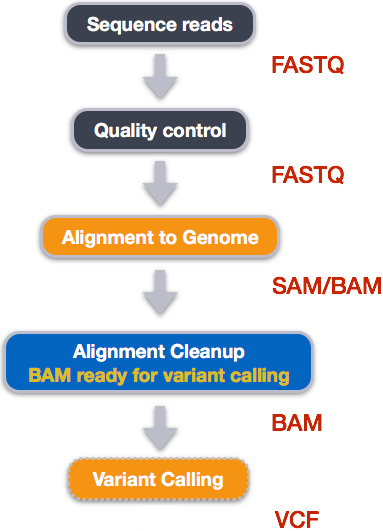

# Variant Calling Workflow part 3 - alignment

We mentioned before that we are working with files from a long-term evolution study of an E. coli population (designated Ara-3). Now that we have looked at our data to make sure that it is high quality, and removed low-quality base calls, we can perform variant calling to see how the population changed over time. We care how this population changed relative to the original population, E. coli strain REL606. Therefore, we will align each of our samples to the E. coli REL606 reference genome, and see what differences exist in our reads versus the genome.

## Alignment to reference genome



We perform read alignment or mapping to determine where in the genome our reads originated from. There are a number of tools to choose from and, while there is no gold standard, there are some tools that are better suited for particular NGS analyses. We will be using the Burrows Wheeler Aligner (BWA), which is a software package for mapping low-divergent sequences against a large reference genome.

The alignment process consists of two steps:

1. Indexing the reference genome
2. Aligning the reads to the reference genome

## Setting up

First we download the reference genome for E. coli REL606. Although we could copy or move the file with cp or mv, most genomics workflows begin with a download step, so we will practice that here.

```
cd /projects/$USER/dc_workshop
mkdir -p data/ref_genome
curl -L -o data/ref_genome/ecoli_rel606.fasta.gz ftp://ftp.ncbi.nlm.nih.gov/genomes/all/GCA/000/017/985/GCA_000017985.1_ASM1798v1/GCA_000017985.1_ASM1798v1_genomic.fna.gz
gunzip data/ref_genome/ecoli_rel606.fasta.gz
```

<span style="background-color:pink">QUESTION: We saved this file as data/ref_genome/ecoli_rel606.fasta.gz and then decompressed it. What is the real name of the genome?</span>

## Variant calling

We will also download a set of trimmed FASTQ files to work with. These are small subsets of our real trimmed data, and will enable us to run our variant calling workflow quite quickly.

```
curl -L -o sub.tar.gz https://ndownloader.figshare.com/files/14418248
tar xvf sub.tar.gz
mv sub/ /projects/$USER/dc_workshop/data/trimmed_fastq_small
```

You will also need to create directories for the results that will be generated as part of this workflow. We can do this in a single line of code, because mkdir can accept multiple new directory names as input.

```
mkdir -p results/sam results/bam results/bcf results/vcf
```

### Index the reference genome

Our first step is to index the reference genome for use by BWA. Indexing allows the aligner to quickly find potential alignment sites for query sequences in a genome, which saves time during alignment. Indexing the reference only has to be run once. The only reason you would want to create a new index is if you are working with a different reference genome or you are using a different tool for alignment.

**In jupyterhub, do:**

```
bwa index data/ref_genome/ecoli_rel606.fasta
```

While the index is created, you will see output that looks something like this:

```
[bwa_index] Pack FASTA... 0.04 sec
[bwa_index] Construct BWT for the packed sequence...
[bwa_index] 1.05 seconds elapse.
[bwa_index] Update BWT... 0.03 sec
[bwa_index] Pack forward-only FASTA... 0.02 sec
[bwa_index] Construct SA from BWT and Occ... 0.57 sec
[main] Version: 0.7.17-r1188
[main] CMD: bwa index data/ref_genome/ecoli_rel606.fasta
[main] Real time: 1.765 sec; CPU: 1.715 sec
```
### Align reads to reference genome

The alignment process consists of choosing an appropriate reference genome to map our reads against and then deciding on an aligner. We will use the BWA-MEM algorithm, which is the latest and is generally recommended for high-quality queries as it is faster and more accurate.

An example of what a `bwa` command looks like is below. This _command will not run_, as we do not have the files `ref_genome.fa`, `input_file_R1.fastq`, or `input_file_R2.fastq`.

```
bwa mem ref_genome.fasta input_file_R1.fastq input_file_R2.fastq > output.sam
```
Have a look at the [bwa options page](http://bio-bwa.sourceforge.net/bwa.shtml). While we are running bwa with the default parameters here, your use case might require a change of parameters. _NOTE: Always read the manual page for any tool before using and make sure the options you use are appropriate for your data._

We are going to start by aligning the reads from just one of the samples in our dataset (SRR2584866). Later, we will be iterating this whole process on all of our sample files.

## Explore the VCF format:

## Assess the alignment (visualization) - optional step
